- [General](#general)
- [Why Async and When?](#why-async-and-when)
  - [Async for Performance/Speed](#async-for-performancespeed)
  - [Note on upper bound for improvement](#note-on-upper-bound-for-improvement)
  - [Async for Scalability](#async-for-scalability)
  - [Landscape of Async techniques in Python](#landscape-of-async-techniques-in-python)
  - [Why threads don't perform in Python - The GIL](#why-threads-dont-perform-in-python---the-gil)
- [async and await (`asyncio`) - Concurrency without threads, without subprocesses](#async-and-await-asyncio---concurrency-without-threads-without-subprocesses)
  - [(Not) Typical Concurrent Programming](#not-typical-concurrent-programming)
    - [I/O driven concurrency](#io-driven-concurrency)
    - [Simple Fibonacci example](#simple-fibonacci-example)
  - [The producer-consumer app](#the-producer-consumer-app)
    - [Synchronous App](#synchronous-app)
    - [Asynchronous App](#asynchronous-app)
      - [The loop](#the-loop)
      - [The Queue](#the-queue)
      - [Tasks in the loop; and the final task](#tasks-in-the-loop-and-the-final-task)
      - [async function](#async-function)
      - [The beautiful thing about using `asyncio`](#the-beautiful-thing-about-using-asyncio)
      - [Summary](#summary)
    - [Anatomy of an async method](#anatomy-of-an-async-method)
  - [`uvloop` - super easy performance gain](#uvloop---super-easy-performance-gain)
  - [Let's do some real work - web scraping with `aiohttp`](#lets-do-some-real-work---web-scraping-with-aiohttp)
  - [Other async capable libraries](#other-async-capable-libraries)
- [Threads & Multi-threaded parallelism](#threads--multi-threaded-parallelism)
  - [Parallel programming with threads](#parallel-programming-with-threads)
  - [Choosing between threads and `asyncio`](#choosing-between-threads-and-asyncio)
  - [Hello threads](#hello-threads)
  - [Something productive with threads](#something-productive-with-threads)
    - [Quick Summary - Starting and Waiting on a thread](#quick-summary---starting-and-waiting-on-a-thread)
    - [Tips for multiple threads](#tips-for-multiple-threads)
    - [Cancelling threads with user input](#cancelling-threads-with-user-input)
    - [WTF does `Thread.join()` do?](#wtf-does-threadjoin-do)
    - [Timeouts pattern](#timeouts-pattern)
  - [Attempting to leverage multiple cores with threads](#attempting-to-leverage-multiple-cores-with-threads)
- [Thread Safety](#thread-safety)
  - [The need for thread safety](#the-need-for-thread-safety)
  - [Demo: An unsafe bank](#demo-an-unsafe-bank)
    - [The Unsafe Bank](#the-unsafe-bank)
  - [Safe Bank with a coarse-grained **global** lock](#safe-bank-with-a-coarse-grained-global-lock)
  - [Safe Bank with a fine-grained lock](#safe-bank-with-a-fine-grained-lock)
    - [Fixing the Deadlock](#fixing-the-deadlock)
    - [Takeaways from fine-grained lock](#takeaways-from-fine-grained-lock)
  - [Summary of Basic Thread Safety](#summary-of-basic-thread-safety)
- [Multi-process parallelism](#multi-process-parallelism)
  - [Overview](#overview)
  - [Example](#example)
    - [Result](#result)
  - [Core Concept - Scaling CPU-bound operations](#core-concept---scaling-cpu-bound-operations)
  - [Returning Values](#returning-values)
    - [Core Concept of returning values with `multiprpcessing`](#core-concept-of-returning-values-with-multiprpcessing)
- [Execution Pools](#execution-pools)
  - [Comparison: multithreading vs multiprocessing api](#comparison-multithreading-vs-multiprocessing-api)
  - [Executor app](#executor-app)
- [Extending async patterns](#extending-async-patterns)
- [Async web frameworks](#async-web-frameworks)
- [Parallelism in C (with Cython)](#parallelism-in-c-with-cython)
- [Notes](#notes)
# General


Definition of Asynchrony in Computer Programming:
> Asynchrony, in computer programming, refers to the occurrence of events independent of the main program flow and ways to deal with such events. 
> These may be "outside" events such as the arrival of signals, or actions instigated by a program that take place concurrently with program execution, without the program blocking to wait for results. 

Essentially it's "stuff happening at the same time".

# Why Async and When?

## Async for Performance/Speed


*(https://www.slideshare.net/Funk98/end-of-moores-law-or-a-change-to-something-else.)*

CPU isn't getting much faster. This is a hardware limitation. It's simply not possible to make smaller circuits in CPU, for thermal and inteference reasons. 

Instead of making the CPU cores faster, what we are doing is just adding more cores. If want to continue Moore's Law, and to take advantage of the processors that are being created these days, we have to write asynchronous code.

To take full advantage of today modern hardware, we have to target more than one CPU cores. The only way to do that is to do things **in parallel**.

If we have anything that is computational and we want to do it as fast as possible using modern hardware, we have to use asynchronous programming.

If we only write our programs synchronously, this is as much utilization as it is going to get:


< 10% of the system CPU, due to the limitation within a single thread.

## Note on upper bound for improvement

Most programs don't scale linearly to the number of cores running on the system. Adding parallelism won't simply speed up the program by X, where X is the number of CPU cores.

Not all of the program execution can be made faster by adding concurrency. Only some are:


In this case, the overall performance boost is at max 20%.

The real question to ask yourself, before introducing any concurrency is: How much can actually be made faster with concurrency? Is it worth the effort and complexity?

What is the upper bound for improvement? There is **always** an upper bound for improvement.

## Async for Scalability

What is scalability? In the context of a website, scalability does not refer to how fast we can handle an individual request. It refers to how many requests can your system handle, until **its performances degrades**.

In fact, as we add scalability to the system, we may actually make it slower to handle individual requests.

Let's visualise three requests being handled/executed in a synchronous fashion, one after another:


In term of execution time, Request 1 and 2 looks relatively similar. Request 3 can definitely be seen as taking less execution time.

However, from the outside world, here is what it appears like:


From the outside world, it took a terribly long time to get a response from Request 3!

If we zoom in to the lower level of how a request is handled, in a world where everything happens synchronously, there is a lot of waiting:


If we could find a way to process Request 2 and Request 3 while waiting for the database trip (red), we could really ramp up scalability.

Let's now visualise the same situation, now with asynchronous execution:


Response time:


Request 3 reaps the most benefit from adding concurrency.

How would we do this at the lower level? During the database trip one request, we could simply start doing other requests, and so on.


## Landscape of Async techniques in Python

There are many different techniques that we'll go through in this course, and these can be applied in different situations. Each technique has their own pros and cons.

However, there are essentially two main "schools" of async techniques in Python, and these are:
- Do more **at once**.
*(similar to the web server example just above.)*
- Do things **faster**.
*(faster computation)*


`trio` and `unsync` are higher level libraries.

## Why threads don't perform in Python - The GIL

Threads in Python don't really perform well. They are fine with waiting, but really don't help for computational work.

Remember the Python program with the `while loop` during which `x+=1`? If we added 12 threads for that, we'd have only gotten 0% gain. 

The reason for this is the **GIL** - **Global Interpreter Lock**. This is essentially why people say Python isn't fast and/or scalable. This is Python's **memory management feature**. This is a thread-safety feature. Without this GIL, Python would run slower on single thread.

The GIL means only one thread, or only one step of execution in Python can ever run at the same time regardless of them being on the same thread, or on multiple different threads. **Only one Python instruction at a time**, no matter where they come from, at any given time.

# async and await (`asyncio`) - Concurrency without threads, without subprocesses

That's right. No threads. No subprocesses.

This is `asyncio`. It helps do **more** at once.


## (Not) Typical Concurrent Programming

The following demonstrates the typical conceptualiation of concurrent programming. 


We have some code running. Then we want to do multiple things at a time. We'd run some code AND kick off some other threads. Then our main thread and all the other threads will run until all the threads have finished with their work. Then, the code continue to be executed in the same direction.

This is typically done with threads, or multiprocessing. This makes a lot of sense.

In the `asyncio` world, this typical concurrent programming doesn't actually happen. Something entirely different happens.

In this `asyncio` world, we are depending on the operating system to schedule the threads, or the processes and manage the concurrency. It's called pre-emptive multiprocessing. It is ultimately the OS job to make sure concurrency happens.
### I/O driven concurrency

In I/O driven concurrency, we don't have multiple threads. We have just one, running along. One thread managing this parallelism.

Typically in a typical concurrent programming, we'd try to do multiple things on multiple threads. 

If we could take those multiple things, and interweaving them together, switching one after another, it would feel just the same.


**The points at which these tasks are broken up** are typically where we are waiting for a database process, calling a web service..etc.. doing anything that essentially involves an external system.

TBH, this isn't true parallelism but more like "efficient programming", doing things during the times where we'd otherwise not do anything apart from waiting. 

This is the underlying programming model of `asyncio` and the `await` keyword. It is also called "Co-operative Multithreading" because it is upto our code to tell the program when to wait (using `await`).

This is also the **easiest** style of parallelism.

### Simple Fibonacci example

> The Fibonacci sequence is a series of numbers in which each number is the sum of the two that precede it. Starting at 0 and 1, the sequence looks like this: 0, 1, 1, 2, 3, 5, 8, 13, 21, 34, and so on forever.
> The Fibonacci sequence can be described using a mathematical equation: Xn+2= Xn+1 + Xn.

```python
from typing import List


def fib(n: int) -> List[int]:
    numbers = []
    current, nxt = 0, 1
    while len(numbers) < n:
        current, nxt = nxt, current + nxt
        numbers.append(current)
    
    return numbers

print(fib(10))
# [1, 1, 2, 3, 5, 8, 13, 21, 34, 55]
```

The Fibonacci sequence is infinite. By specifying an input, we are limiting this to a finite set. 

What if we don't want that finite set, but rather work through all the numbers, and see if any of them meet a specific condition? In that case, we can't really specify an input.

What would be good is that the **consumer** of this generate infinite fib numbers decides when they have had enough. We can do that with a generator.

```py
def fib(n:int) -> Iterator[int]:
    current, nxt = 0,1
    while True:
        curent, nxt = next, current + nxt
        yield current

for n in fib():
    print(n, end = ', ')
    if n > 10000:
        break

# 1, 1, 2, 3, 5, 8, 13, 21, 34, 55, 89, 144, 233, 377, 610, 987, 1597, 2584, 4181, 6765, 10946, %
```

Understanding the ideal behind generator is key in understanding how `asyncio` works. Generators are "restartable functions". 

If we just call a function that outputs a generator, it wouldn't run. The genarator would only start generating when we actually pull on it, like `print()`.

If we use a debugger to step through the above code, we'd see that within the actual loop, the python interpreter never steps through the `def fib()`, but it goes straigh into the loop within the function. That's an important thing to understand.

They are also **restartable**, which means that we can run it, pause, then resume. There is no parallelism going on. But you can build pretty good co-operative parallelism with generator functions.

## The producer-consumer app

This is a common pattern. The idea is that there are some parts of the system that typically run independently and asynchronously. 

One generates an item (generate a report, send this email, trigger this alert). This is the **producer**.

There's another part of the system that's running asynchronously that looks for work to be done. This is the **consumer**. It picks up these jobs that have been created by the producer and starts working on them.

### Synchronous App

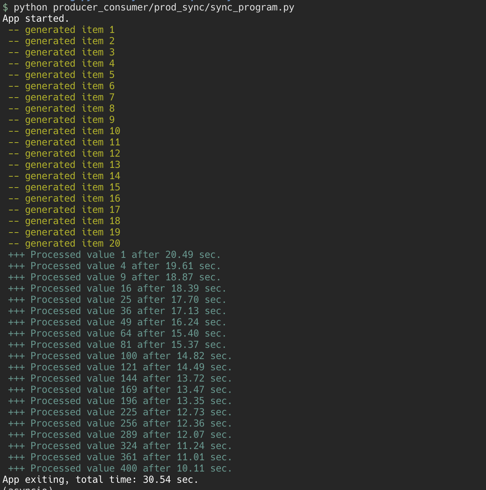

The producer and the consumer are working synchronously. As such, the consumer doesn't get to consume until 20 second mark.

```py
    generate_data(20, data)
    process_data(20, data)
```

The overall time it took to run was 30.60 sec.

We could improve this tremendously by using `asyncio`.

### Asynchronous App

There are a couple of things we need to do to make a program asynchronous. 

Syntactically simple but conceptually complex.

#### The loop

In order to run asynchronous code routine, we can't just call them like a normal function. We have to call them in an asyncio loop. That asyncio loop is going to execute on whatever thread or environment that we started on. It is **our** job to create and run that loop.
```py
loop = asyncio.new_event_loop()
```

Later on, this loop is set to run until complete
```py
    loop.run_until_complete(something_we_need_to_pass_in)
```

What is going into the function? Essentially the functions that we want to run asynchronously until completed.

We also need to change the type of data that we need to use. Right now we have a list.
```py
data = []
```

#### The Queue

We can use a list. But `asyncio` has a way to deal with this better.
```py
data = asyncio.Queue()
```

A queue is cool. Something goes in something comes out. FIFO.

A queue allows us to wait and tell `asyncio` to continue doing other work, until something comes in this queue, then wakes up/ resume the code routine and get it running.

Wih this new `Queue` type, we also change the way we interact with it. `append` is now `put` and `pop` is new `get`.

Then, we are going to kick the execution of `generate_data` and `process_data` separately together, then put it to `run_until_complete()`.

#### Tasks in the loop; and the final task

We need to create the tasks in the loop.
```py
task1 = loop.create_task(generate_data(20, data))
task2 = loop.create_task(produce_data(20, data))
```
 
The `run_until_complete()` takes a single thing to run. This thing is of type `future`.
```py
final_task = asyncio.gather([task1, task2])
```

Then..
```py
loop.run_until_complete(final_task)
```

That is the execution level code. However we don't yet have async code routine down below.

So our next task is to convert those functions into async code routine.

#### async function

How do we adapt the two functions to `asyncio`?

There are two things that we need to do to make a synchronous code routine asynchonous.

We have to mark the method as an `async` method.
```py
async def generate_data(num: int, data: asyncio.Queue):
```

This is just the function signature. It doesn't actually matter. Just because the code says it is async, doesn't mean that it will run async.

We have to actually convert the logic to async by breaking it down to little pieces of unit and the dividing point are "Where are we waiting?", "What are we waiting on?".

The most obvious answer to "Where are we waiting?" is at `time.sleep()`. We don't want to do `time.sleep()`.

There is a better way to say "I am done with my work, I am going to take a rest for a while, you can keep working" by `asyncio.sleep()`.

You also have to use `await` in front of the async operation. This will break up the code into little slices.
```py
async def generate_data(num: int, data: asyncio.Queue):
    for idx in range(1, num + 1):
        item = idx*idx
        await data.put((item, datetime.datetime.now()))

        print(colorama.Fore.YELLOW + f" -- generated item {idx}", flush=True)
        await asyncio.sleep(random.random() + .5)
```

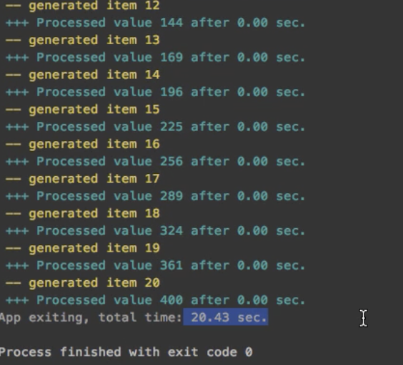

Because the consumer is much faster than the producer, or the produce isn't producing as fast as the consumer can consume, we keep seeing `0.00 sec`.

So let's make one change, let's have two producers and make the consumers expect more inputs.

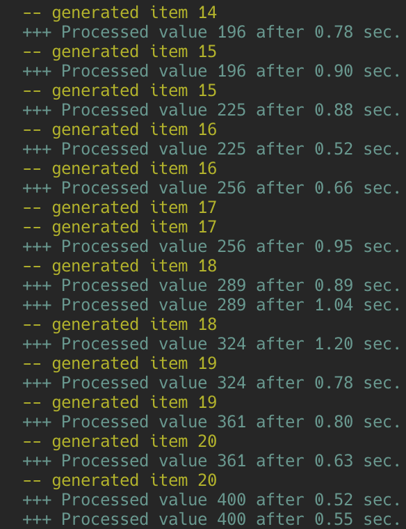

The execution time of 22 seconds would have been 50 if this routine was done synchronously.

#### The beautiful thing about using `asyncio`

All we had to was to break up these functions into parts where we are waiting on something else. 

We did't have to change our programming model at all. This is the most important thing. We are using the exact same code.

The programming model is still the synchronous model we use. 

#### Summary

In summary, here is what we did:
```
1. Create a loop
2. Create tasks
3. Run the tasks until they complete
```

The improvement in the `after` latency time is insane.
```
 -- generated item 16
 -- generated item 17
 -- generated item 18
 -- generated item 19
 -- generated item 20
 +++ Processed value 1 after 20.49 sec.
 +++ Processed value 4 after 19.61 sec.
 +++ Processed value 9 after 18.87 sec.
 +++ Processed value 16 after 18.39 sec.
 +++ Processed value 25 after 17.70 sec.
 +++ Processed value 36 after 17.13 sec.
 +++ Processed value 49 after 16.24 sec.
 +++ Processed value 64 after 15.40 sec.
 +++ Processed value 81 after 15.37 sec.
 +++ Processed value 100 after 14.82 sec.
 +++ Processed value 121 after 14.49 sec.
 +++ Processed value 144 after 13.72 sec.
 +++ Processed value 169 after 13.47 sec.
 +++ Processed value 196 after 13.35 sec.
 +++ Processed value 225 after 12.73 sec.
 +++ Processed value 256 after 12.36 sec.
 +++ Processed value 289 after 12.07 sec.
 +++ Processed value 324 after 11.24 sec.
 +++ Processed value 361 after 11.01 sec.
 +++ Processed value 400 after 10.11 sec.
```

versus

```
 -- generated item 15
 +++ Processed value 225 after 0.88 sec.
 -- generated item 16
 +++ Processed value 225 after 0.52 sec.
 -- generated item 16
 +++ Processed value 256 after 0.66 sec.
 -- generated item 17
 -- generated item 17
 +++ Processed value 256 after 0.95 sec.
 -- generated item 18
 +++ Processed value 289 after 0.89 sec.
 +++ Processed value 289 after 1.04 sec.
 -- generated item 18
 +++ Processed value 324 after 1.20 sec.
 -- generated item 19
```
### Anatomy of an async method

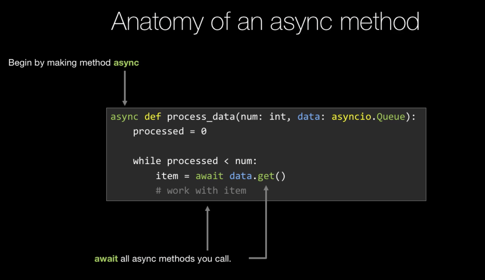


## `uvloop` - super easy performance gain

> uvloop is a fast, drop-in replacement of the built-in asyncio event loop. uvloop is implemented in Cython and uses libuv under the hood.
> *https://github.com/MagicStack/uvloop*

`uvloop` is a re-implementation of the `asyncio` event loop.

Due to the way that Python works, the `async` `await` keyword can be used with different implementations of event loops. `uvloop` is one of those. 

`uvloop` makes `asyncio` 2-4x faster. 

See here:
```
$ python loops/loops_asyncio/loop_program.py 
Running standard loop with 500,000 actions.

$ python loops/loops_uv/loop_program_uv.py 
Running standard loop with 500,000 actions.
App exiting, total time: 1.77 sec.  
```

Let's inspect this program, implemented using `asyncio` event loop.
```py
$ bat loops/loops_asyncio/loop_program.py   
       File: loops/loops_asyncio/loop_program.py
   1   import datetime
   2   import colorama
   3   import asyncio
   4   
   5   
   6   def main():
   7       lim = 250_000
   8       print(f"Running standard loop with {lim * 2:,} actions.")
   9       t0 = datetime.datetime.now()
  10   
  11       # Changed this from the video due to changes in Python 3.10:
  12       # DeprecationWarning: There is no current event loop, loop = asyncio.get_event_loop()
  13       loop = asyncio.new_event_loop()
  14   
  15       data = asyncio.Queue()
  16   
  17       task1 = loop.create_task(generate_data(lim, data))
  18       task3 = loop.create_task(generate_data(lim, data))
  19       task2 = loop.create_task(process_data(2 * lim, data))
  20   
  21       final_task = asyncio.gather(task1, task2, task3)
  22       loop.run_until_complete(final_task)
  23   
  24       dt = datetime.datetime.now() - t0
  25       print(colorama.Fore.WHITE + f"App exiting, total time: {dt.total_seconds():,.2f} sec.", flush=True)
  26   
  27   
  28   async def generate_data(num: int, data: asyncio.Queue):
  29       for idx in range(1, num + 1):
  30           item = idx * idx
  31           await data.put((item, datetime.datetime.now()))
  32           await asyncio.sleep(0)
  33   
  34   
  35   async def process_data(num: int, data: asyncio.Queue):
  36       processed = 0
  37       while processed < num:
  38           await data.get()
  39           processed += 1
  40           await asyncio.sleep(0)
  41   
  42   
  43   if __name__ == '__main__':
  44       main()    
```

We are not sleeping much (L32). Essentially, we are just telling the program to "give up" the time slice, let something else run, and immediately pick up and keep going. 

We are doing this 250,000 times each task, so 1,000,000 times in total.

Re-implementing this using `uvloop` event loop is relatively simple:
```py
import uvloop

asyncio.set_event_loop_policy(uvloop.EventLoopPolicy())
```

All you need to do is import `uvloop` into the module, and ask `asyncio` to use `uvloop` event loop implementation when creating event loop.

## Let's do some real work - web scraping with `aiohttp`

In `asyncio/web_scraping/sync_scrape/program.py`, we are scraping the HTML and title of some HTML pages.

```py
$ python web_scraping/sync_scrape/program.py     
Getting HTML for episode 150
Getting TITLE for episode 150
Title found: Technical Lessons Learned from Pythonic Refactoring
Getting HTML for episode 151
Getting TITLE for episode 151
Title found: Gradual Typing of Production Applications
Getting HTML for episode 152
Getting TITLE for episode 152
Title found: Understanding and using Python's AST
Getting HTML for episode 153
Getting TITLE for episode 153
Title found: How Python Evolves
Getting HTML for episode 154
Getting TITLE for episode 154
Title found: Python in Biology and Genomics
Getting HTML for episode 155
Getting TITLE for episode 155
Title found: Practical steps for moving to Python 3
Getting HTML for episode 156
Getting TITLE for episode 156
Title found: Python History and Perspectives
Getting HTML for episode 157
Getting TITLE for episode 157
Title found: The Journal of Open Source Software
Getting HTML for episode 158
Getting TITLE for episode 158
Title found: Quantum Computing and Python
Getting HTML for episode 159
Getting TITLE for episode 159
Title found: Inside the new PyPI launch
Done in 9.68 sec.  
```

Let's convert this synchronous function to run asynchronously.

First, in order for us to start writing async code, we need to implement a library that actually supports `asyncio`. These are libraries that have asynhronous methods and code routines that we can `await`.

For our example, let's look at `aiohttp`, to be implemented in place of `requests`.

Here are the packages we need:
```
asyncio
asyncdns
cchardet
```

Let's have a stab:
```py
import asyncio
import datetime

import aiohttp
import bs4
from colorama import Fore


async def get_html(episode_number: int) -> str:
    print(Fore.YELLOW + f"Getting HTML for episode {episode_number}", flush=True)

    url = f"https://talkpython.fm/{episode_number}"

    async with aiohttp.ClientSession() as session:
        async with session.get(url) as resp:
            resp.raise_for_status()
            return await resp.text()


def get_title(html: str, episode_number: int) -> str:
    print(Fore.CYAN + f"Getting TITLE for episode {episode_number}", flush=True)
    soup = bs4.BeautifulSoup(html, "html.parser")
    header = soup.select_one("h1")
    if not header:
        return "MISSING"

    return header.text.strip()


def main():
    t0 = datetime.datetime.now()

    loop = asyncio.get_event_loop()
    loop.run_until_complete(get_title_range())

    dt = datetime.datetime.now() - t0
    print(f"Done in {dt.total_seconds():.2f} sec.")


async def get_title_range():
    # Please keep this range pretty small to not DDoS my site. ;)
    for n in range(150, 160):
        html = await get_html(n)
        title = get_title(html, n)
        print(Fore.WHITE + f"Title found: {title}", flush=True)


if __name__ == "__main__":
    main()
```

The `async with` is an extension of Python's existing context manager.

When we run this program, there is no improvement in speed..
```
$ python web_scraping/async_scrape/program.py
/home/kkennynguyen/deve/async-techniques-python/asyncio/web_scraping/async_scrape/program.py:33: DeprecationWarning: There is no current event loop
  loop = asyncio.get_event_loop()
Getting HTML for episode 150
Getting TITLE for episode 150
Title found: Technical Lessons Learned from Pythonic Refactoring
Getting HTML for episode 151
Getting TITLE for episode 151
Title found: Gradual Typing of Production Applications
Getting HTML for episode 152
Getting TITLE for episode 152
Title found: Understanding and using Python's AST
Getting HTML for episode 153
Getting TITLE for episode 153
Title found: How Python Evolves
Getting HTML for episode 154
Getting TITLE for episode 154
Title found: Python in Biology and Genomics
Getting HTML for episode 155
Getting TITLE for episode 155
Title found: Practical steps for moving to Python 3
Getting HTML for episode 156
Getting TITLE for episode 156
Title found: Python History and Perspectives
Getting HTML for episode 157
Getting TITLE for episode 157
Title found: The Journal of Open Source Software
Getting HTML for episode 158
Getting TITLE for episode 158
Title found: Quantum Computing and Python
Getting HTML for episode 159
Getting TITLE for episode 159
Title found: Inside the new PyPI launch
Done in 9.53 sec.  
```

Why? Look here:
```py
async def get_title_range():
    # Please keep this range pretty small to not DDoS my site. ;)
    for n in range(150, 160):
        html = await get_html(n)
        title = get_title(html, n)
        print(Fore.WHITE + f"Title found: {title}", flush=True)

```

We are only doing one thing at a time. What we want is to **start all the requests**, and THEN process the responses as they come in.

Let's re-implement this:
```py
async def get_title_range():
    tasks = []

    # Start ALL the requests at once
    for n in range(150, 160):
        tasks.append((n, asyncio.create_task(get_html(n))))

    # Process all the requests, as they come in
    for n, t in tasks:
        html = await t
        title = get_title(html, n)
        print(Fore.WHITE + f"Title found: {title}", flush=True)
```

```
$ python web_scraping/async_scrape/program.py
/home/kkennynguyen/deve/async-techniques-python/asyncio/web_scraping/async_scrape/program.py:33: DeprecationWarning: There is no current event loop
  loop = asyncio.get_event_loop()
Getting HTML for episode 150
Getting HTML for episode 151
Getting HTML for episode 152
Getting HTML for episode 153
Getting HTML for episode 154
Getting HTML for episode 155
Getting HTML for episode 156
Getting HTML for episode 157
Getting HTML for episode 158
Getting HTML for episode 159
Getting TITLE for episode 150
Title found: Technical Lessons Learned from Pythonic Refactoring
Getting TITLE for episode 151
Title found: Gradual Typing of Production Applications
Getting TITLE for episode 152
Title found: Understanding and using Python's AST
Getting TITLE for episode 153
Title found: How Python Evolves
Getting TITLE for episode 154
Title found: Python in Biology and Genomics
Getting TITLE for episode 155
Title found: Practical steps for moving to Python 3
Getting TITLE for episode 156
Title found: Python History and Perspectives
Getting TITLE for episode 157
Title found: The Journal of Open Source Software
Getting TITLE for episode 158
Title found: Quantum Computing and Python
Getting TITLE for episode 159
Title found: Inside the new PyPI launch
Done in 1.36 sec.  
```

The performance improvement here is pretty crazy. 

One important note is that if the number of tasks that we launch is significantly higher, we might want to implement some sort of rate-limitting, not to let the tasks get out of control.

## Other async capable libraries

If we want to take advantage of asynchronous programming, it is critical that the libraries that we are using, to talk to various external systems, provide asynchronous methods. 


- `aiofiles` for file system. This library enables starting asynchronous job streams for read/write operation of system files.
- `umongo` enables asynchronous operations when interacting with MongoDB. It is a very cool library that is feature rich.
- `asyncpg` is a fast PostgreSQL database client library.
- `asyncio-redis` can be used with Redis, which in turn is normally used for in-memory cache.

# Threads & Multi-threaded parallelism

Using threads is one of the main way to add concurrency to Python programs.

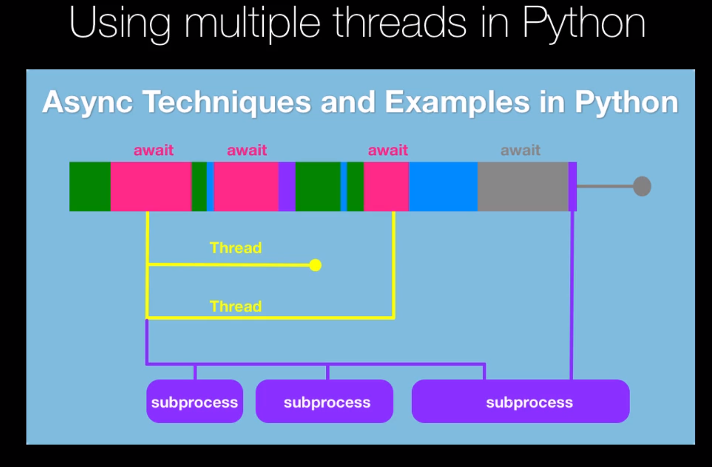

Because of Python's GIL, threads don't really let us leverage multiple cores to do actual concurrent CPU-bound operations. Again this is a Python limitation.

So using threads is very similar to `asyncio` in that sense of "do more at once", in the async python landscape.

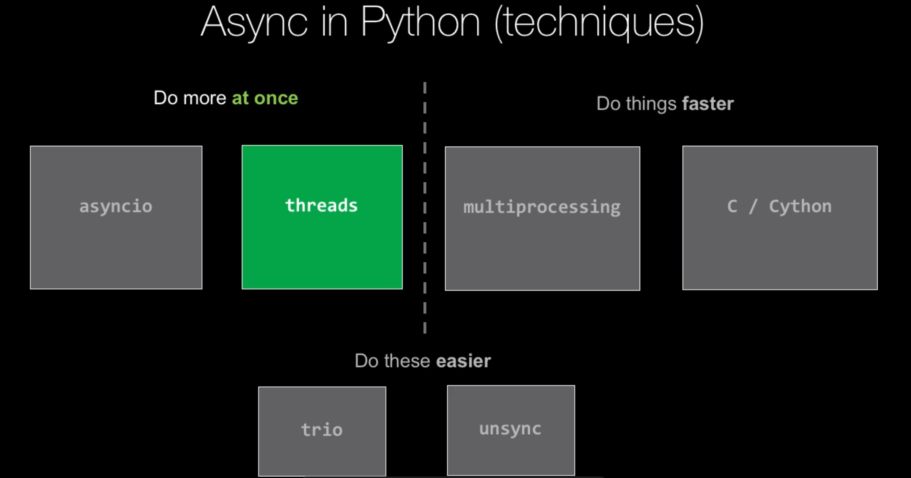

## Parallel programming with threads


This picture visualizes a process. This process can kick off different threads (grey arrows). We have our main programming running and then at some point kicks off two different threads, then it spends some time waiting for the threads to finish (broken lines) and then carries on working. 

This is the fork-join pattern. Fork; then join.

This fork join pattern is very common in threaded programming. It is important to realise that these threads are all working in the same process and share a common memory space of variables (memory heap).

This is why in threaded programming, we need to take special care with shared variables and states.

## Choosing between threads and `asyncio`

Both of these live in the "Do more at once while we are waiting on something from an external system". This is in oppose to leveraging the computational power of our CPU.

In some sense they are kind of doing the same thing. `asyncio` programming model however is nicer and cleaner. 

The thing is, `asyncio` can only be used with other libraries that implement async methods. In other words, `asyncio` can only be used with libraries that support `asyncio`.

Most libraries out there are not.

So the thing with the GIL is that it prevents leveraging threads to be used for CPU-bound activities. The GIL only lets you perform one operation at a time. However, there is one important caveat. If we call a function that itself goes over the network, or talk to the file system, i.e any i/o operation, deep deep down in the implementation, **Python will let go of the GIL while it is waiting for the i/o operation**.

So, as an example, let's say we have a library, like SQLAlchemy, a database ORM that talks to a database, but doesn't have `asyncio` support. However, simply because it **does** talk to a database, we could ask these database queries to work on multiple threads. As these operations go over the network, Python will release the GIL.

So the takeaway is: use `asyncio` when you **can**, use threads when you **must**.

Use `asyncio` if the support is there. Use threads when `asyncio` support isn't there, but you will have to do a bit more work to construct the tasks yourself.

## Hello threads

Let's write a simple program:
```py
$ bat hello_threads/simple.py 
       File: hello_threads/simple.py
   1   import time
   2   import threading
   3   
   4   def main():
   5       t = threading.Thread(target=greeter, args=("Misha", 100))
   6       t.start()
   7       print("Done.")
   8   
   9   def greeter(name: str, times:int):
  10       for _ in range(0, times):
  11           print("Hello there {}".format(name))
  12           time.sleep(1)
  13   
  14   if __name__ == '__main__':
  15       main()
```
```sh
$ python hello_threads/simple.py
Hello there Misha
Done.
Hello there Misha
Hello there Misha
Hello there Misha
Hello there Misha
...
```

As demonstrated above, the main main method/program has exited. However, somehow, the other thread is still running doing its things.

That is because on default, threads in Python are **foreground** threads. If any of those are running, even if the main thread has exited, those threads will still continue to run.

If we want the threads to stop once the main method has exited, we need to run those threads in background mode by adding `daemon=True`:
```py
5     t = threading.Thread(target=greeter, args=("Misha", 100), daemon=True)
```
```
$ python hello_threads/simple.py 
Hello there Misha
Done. 
```

Continuing on...
```py
import threading
import time


def main():
    t = threading.Thread(target=greeter, args=("Misha", 100), daemon=True)
    t.start()

    print("This is some other work.")
    print(5 * 5)

    t.join()  # this is the JOIN operation in fork join pattern

    print("Done.")


def greeter(name: str, times: int):
    for _ in range(0, times):
        print("Hello there {}".format(name))
        time.sleep(1)


if __name__ == "__main__":
    main()
```


If we want to create multiple threads, using **list comprehension** is a good approach to make code cleaner.
```python
$ bat hello_threads/hello.py 
       File: hello_threads/hello.py
   1 ‾ import threading
   2 + import time
   3   
   4   
   5   def main():
   6       threads = [
   7           threading.Thread(target=greeter, args=("Michael", 10), daemon=True),
   8           threading.Thread(target=greeter, args=("Sarah", 5), daemon=True),
   9           threading.Thread(target=greeter, args=("Zoe", 2), daemon=True),
  10           threading.Thread(target=greeter, args=("Mark", 11), daemon=True),
  11       ]
  12   
  13       [t.start() for t in threads]
  14   
  15       print("This is other work.")
  16       print(2 * 2)
  17   
  18 ~     [t.join() for t in threads]
  19   
  20       print("Done.")
  21   
  22   
  23   def greeter(name: str, times: int):
  24       for n in range(0, times):
  25           print(f"{n}. Hello there {name}")
  26           time.sleep(1)
  27   
  28   
  29 ~ if __name__ == "__main__":
  30       main()      
```

One final thing is that we could set a time out here:
```py
  18 ~     [t.join(timeout=1) for t in threads]
```

Without the `timeout`, essentially we are waiting forever for the threads to finish. If we are willing to wait `1 second`, some threads may not finish:
```
$ python hello_threads/hello.py
0. Hello there Michael
0. Hello there Sarah
0. Hello there Zoe
0. Hello there Mark
This is other work.
4
1. Hello there Michael
1. Hello there Sarah
1. Hello there Zoe
1. Hello there Mark
2. Hello there Michael
2. Hello there Sarah
2. Hello there Mark
3. Hello there Michael
Done.      
```
## Something productive with threads

Let's come back to our producer-consumer example.

This is the synchronous program:
```py
       File: basic_threads/sync_prod.py
   1   import datetime
   2   import colorama
   3   import random
   4   import time
   5   
   6   
   7   def main():
   8       t0 = datetime.datetime.now()
   9       print(colorama.Fore.WHITE + "App started.", flush=True)
  10       data = []
  11   
  12       generate_data(20, data)
  13       generate_data(20, data)
  14       process_data(40, data)
  15   
  16       dt = datetime.datetime.now() - t0
  17       print(colorama.Fore.WHITE + f"App exiting, total time: {dt.total_seconds():,.2f} sec.", flush=True)
  18   
  19   
  20   def generate_data(num: int, data: list):
  21       for idx in range(1, num + 1):
  22           item = idx * idx
  23           data.append((item, datetime.datetime.now()))
  24   
  25           print(colorama.Fore.YELLOW + f" -- generated item {idx}", flush=True)
  26           time.sleep(random.random() + .5)
  27   
  28   
  29   def process_data(num: int, data: list):
  30       processed = 0
  31       while processed < num:
  32           item = data.pop(0)
  33           if not item:
  34               time.sleep(.01)
  35               continue
  36   
  37           processed += 1
  38           value = item[0]
  39           t = item[1]
  40           dt = datetime.datetime.now() - t
  41   
  42           print(colorama.Fore.CYAN +
  43                 f" +++ Processed value {value} after {dt.total_seconds():,.2f} sec.", flush=True)
  44           time.sleep(.5)
  45   
  46   
  47   if __name__ == '__main__':
  48       main()  
```

Let's say we don't have `asyncio` to convert this to asynchronous programming. How would we model this with threads?

Instead of...
```py
data = []

generate_data(20, data)
generate_data(20, data)
process_data(40, data)
```

...we do:
```py
data = []

threads = [
    threading.Thread(target=generate_data, args=(20, data), daemon=True),
    threading.Thread(target=generate_data, args=(20, data), daemon=True),
    threading.Thread(target=process_data, args=(40, data), daemon=True),
]

[t.start() for t in threads]


print("Started...")

[t.join() for t in threads]
```

### Quick Summary - Starting and Waiting on a thread

```python
import threading

def generate_data(num: int, inputs: list):
    # normal synchronous code here

# Create thread
work = threading.Thread(target=generate_data, args=(20, []), daemon=True)

# Start thread
work.start()

# Other work while generate_data is running...
# Remember the Gil, so this work shouldn't be computational, but more i/o

# Wait for completion
work.join()
```

### Tips for multiple threads

```py
data = []

threads = [
    threading.Thread(target=generate_data, args=(20, data)),
    threading.Thread(target=generate_data, args=(20, data)),
    threading.Thread(target=process_data, args=(40, data)),
]

[t.start() for t in threads]

[t.join() for t in threads]
```

### Cancelling threads with user input

Let's say we want to give user the option to cancel the program by providing an input, while the program is running.

We can do this by creating another thread:
```py
abort_thread = threading.Thread(target=check_cancel, daemon=True)
abort_thread.start() 

while any([t.is_alive() for t in threads]):
    [t.join(.001) for t in threads]
    if not abort_thread.is_alive():
        print("Cancelling on your request!", flush=True)
        break

def check_cancel():
    print(colorama.Fore.RED + "Press enter to cancel...", flush=True)
    input()
```

Here, we are running a thread. This thread's task is simply to wait and watch if the user has pressed Enter. If Enter is pressed, the thread will exit.
```py
def check_cancel():
    print(colorama.Fore.RED + "Press enter to cancel...", flush=True)
    input()
```

While the other working threads are alive, we check if the `abort_thread` is alive or not. If it was not, then the loop is broken and the program exits.

### WTF does `Thread.join()` do?

The `.join()` operation asks the main program to wait for the thread to end before continuing. Without `join()`, the main program will end and the thread will continue.
### Timeouts pattern

```py
threads = [
    threading.Thread(target=generate_data, args=(20, data), daemon=True),
    threading.Thread(target=generate_data, args=(20, data), daemon=True),
    threading.Thread(target=process_data, args=(40, data), daemon=True),
]

[t.start() for t in threads]

while any([t.is_alive() for t in threads]):
    [t.join(0.001) for t in threads]
    # Check whether we want to keep waiting...
```

Let's review this timeout operation. Here we have some threads, and we have started all the threads.

What we'd like to do is, we want to let these threads run until they get some kind of signals (which could be anything, a boolean variable that is set to `True`, or a value set in the database, or an alert/email). When the signal arrives, we want to bail out of the threads.

Small Note: So far we have been able to make the threads stop by simply letting the process exit. If this was a longer running process, such as a web service process that was alive for a long time, we'd have to abort the threads. Keep this in mind.

```py
while any([t.is_alive() for t in threads]):
    [t.join(10) for t in threads]
```

So here we have a `while` loop and we are saying "while any of the thread is still working, we are going to do a quick join on them, and say.. hey let's wait for a little bit and then we are going to do our check".

Then here we ask the question: Are you still alive? 

So we are basically using join to put our threads to sleep. We could also do a `time.sleep()` here, but this one will cancel quicker if all of the threads are finished.

This is a simple timeout pattern that we can use in Python threads.

## Attempting to leverage multiple cores with threads

Up until this point we have established that thread usage belongs more in the "do more at once" camp, not "do things faster".

Let's try to see if we can leverage a multiple core system to speed up a computation-intensive program.
```sh
$ python cpu_attempt/compute_it.py 
Done in 4.38 sec.
```

```py
15       processor_count = multiprocessing.cpu_count()
16       threads = []
17   
18       # partition the computation work across multiple threads
19       for n in range(1, processor_count + 1):
20           threads.append(Thread(target=do_math,
21                                 args=(30_000_000 * (n - 1) / processor_count,
22                                       30_000_000 * n / processor_count),
23                                 daemon=True)
24                          )
25   
26       [t.start() for t in threads]
27       [t.join() for t in threads]
28   
29       dt = datetime.datetime.now() - t0
30       print(f"Done in {dt.total_seconds():,.2f} sec.")
```

```
$ python cpu_attempt/compute_threaded.py 
Doing math on 12 processors.
Done in 5.12 sec.  
```

Here is a concrete example of where the GIL is raising its head. Regardless of how many threads are running, the interpreter is only going to process one instruction at a time.

So, computation-intensive problems like these cannot be solved using Python threads. If we were using other languages, using threads for these would make the program run a lot faster.

In conclusion, threads cannot be used to speed up computationally intensive programs. For those, we'd need to use multiprocessing or C/ Cython.

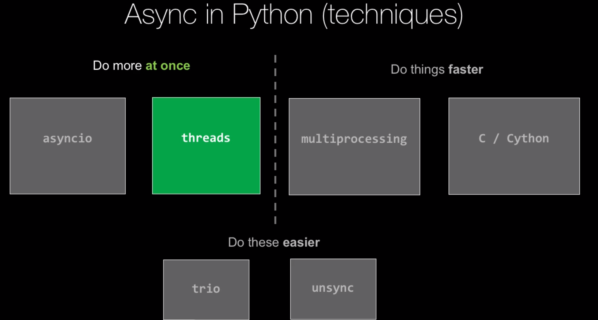

# Thread Safety

No conversation about threads is complete without the mentioning about the topic of thread safety.

Once we work with threads, we take on a whole new level of responsibility and we need to think about several types of problems. The goal is to prevent things like race conditions or data corruption in our program.

Threads require *explicit** safety measures.

The errors that we encounter when threading are extremely difficult to track down in real programs. They are super frustrating. 

Why? They depend on timing, and on hardware and specific loading conditions. Often they have to do with one part of the system getting in-sync or out-of-sync with another part of the system. When we attach a debugger to figure out what's going on, or when we are investigating using our local machine, without the extra load, maybe those specific conditions wouldn't re-create themselves.

So, this is why we need to be especially careful when using threads.

## The need for thread safety

Let's think about the state of a program as we call an individual function.

As per illustrated below, the black box represents a function call. The blue shapes on the right are data structures. We have two pointers, one to a class, that holds another class that points at a speficic item in a list. The other pointer holds the list.

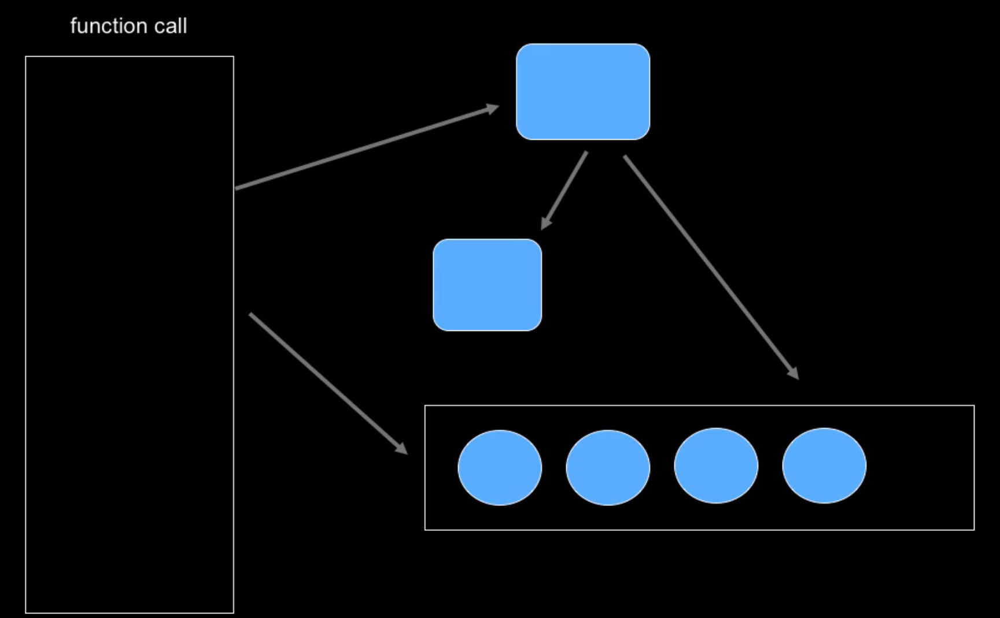

Blue represents a healthy, valid state. In most situations, if the program was to stop, it would be in a valid state.
 
However, during the execution of the program, sometimes it evolves into an invalid state temporarily. This cannot be helped with.

The problem with threading is that we'd have more than one instance of these programs running at the same time. If they share a data structure, we'd have a threading bug.

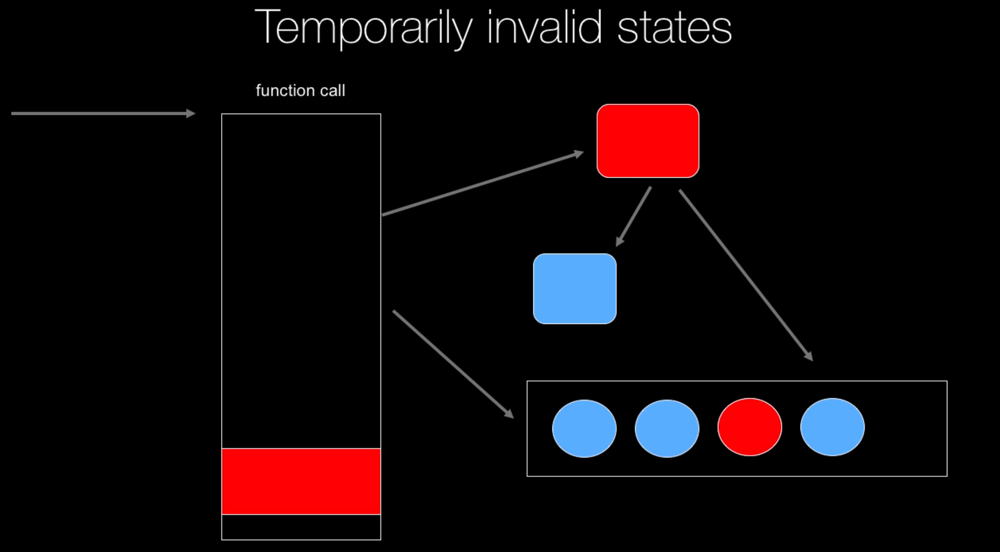

The goal of thread safety is to prevent other parts of the program interact with the part of data that's being worked on, while the program is in a temporary invalid state. Essentially, we'd isolate the temporarily invalidated state until it becomes validated again. Then we'd allow all the threads to interact with it.

## Demo: An unsafe bank

### The Unsafe Bank

```py
8   class Account:
9       def __init__(self, balance=0):
10           self.balance = balance
11   
12   
13   def main():
14       accounts = create_accounts()
15       total = sum(a.balance for a in accounts)
16   
17       validate_bank(accounts, total)
18       print("Starting transfers...")
```

Let's say we create a bunch of bank accounts and transfer money between them. One of the property of this setting is that the `total` amount of money in all the banks should remain the same. Under no circumstances should this `total` be changed.

Then, we kick off a bunch of threads to `do_bank_stuff`. We also pass in the `total` figure so that it can be validated during the operation.
```py
20       jobs = [
21           Thread(target=do_bank_stuff, args=(accounts, total)),
22           Thread(target=do_bank_stuff, args=(accounts, total)),
23           Thread(target=do_bank_stuff, args=(accounts, total)),
24           Thread(target=do_bank_stuff, args=(accounts, total)),
25           Thread(target=do_bank_stuff, args=(accounts, total)),
26       ]
...
39   def do_bank_stuff(accounts, total):
40       for _ in range(1, 10000):
41           a1, a2 = get_two_accounts(accounts)
42           amount = random.randint(1, 100)
43           do_transfer(a1, a2, amount)
44           validate_bank(accounts, total, quiet=True)
45   
...
58   def do_transfer(from_account: Account, to_account: Account, amount: int):
59       if from_account.balance < amount:
60           return
61   
62       from_account.balance -= amount
63       time.sleep(.000) # give up the current time slice
64       to_account.balance += amount
65   
```

```
$ python unsafe_bank.py 
All good: Consistent account balance: $44,500
Starting transfers...
ERROR: Inconsistent account balance: $44,460 vs $44,500
ERROR: Inconsistent account balance: $44,421 vs $44,500
ERROR: Inconsistent account balance: $44,437 vs $44,500
ERROR: Inconsistent account balance: $44,402 vs $44,500
ERROR: Inconsistent account balance: $44,437 vs $44,500
ERROR: Inconsistent account balance: $44,402 vs $44,500
ERROR: Inconsistent account balance: $44,458 vs $44,500
ERROR: Inconsistent account balance: $44,495 vs $44,500
ERROR: Inconsistent account balance: $44,426 vs $44,500
ERROR: Inconsistent account balance: $44,402 vs $44,500
ERROR: Inconsistent account balance: $44,426 vs $44,500
ERROR: Inconsistent account balance: $44,426 vs $44,500
ERROR: Inconsistent account balance: $44,426 vs $44,500
ERROR: Inconsistent account balance: $44,495 vs $44,500
ERROR: Inconsistent account balance: $44,479 vs $44,500
ERROR: Inconsistent account balance: $44,409 vs $44,500
ERROR: Inconsistent account balance: $44,494 vs $44,500
ERROR: Inconsistent account balance: $44,418 vs $44,500
ERROR: Inconsistent account balance: $44,409 vs $44,500
ERROR: Inconsistent account balance: $44,423 vs $44,500
ERROR: Inconsistent account balance: $44,429 vs $44,500
ERROR: Inconsistent account balance: $44,487 vs $44,500
ERROR: Inconsistent account balance: $44,464 vs $44,500
ERROR: Inconsistent account balance: $44,452 vs $44,500
ERROR: Inconsistent account balance: $44,478 vs $44,500
ERROR: Inconsistent account balance: $44,469 vs $44,500
ERROR: Inconsistent account balance: $44,416 vs $44,500
ERROR: Inconsistent account balance: $44,408 vs $44,500
ERROR: Inconsistent account balance: $44,458 vs $44,500
ERROR: Inconsistent account balance: $44,427 vs $44,500
ERROR: Inconsistent account balance: $44,446 vs $44,500
ERROR: Inconsistent account balance: $44,482 vs $44,500
ERROR: Inconsistent account balance: $44,482 vs $44,500
ERROR: Inconsistent account balance: $44,482 vs $44,500
ERROR: Inconsistent account balance: $44,482 vs $44,500
ERROR: Inconsistent account balance: $44,451 vs $44,500
ERROR: Inconsistent account balance: $44,416 vs $44,500
ERROR: Inconsistent account balance: $44,492 vs $44,500
ERROR: Inconsistent account balance: $44,483 vs $44,500
ERROR: Inconsistent account balance: $44,412 vs $44,500
ERROR: Inconsistent account balance: $44,434 vs $44,500
ERROR: Inconsistent account balance: $44,411 vs $44,500
ERROR: Inconsistent account balance: $44,478 vs $44,500
Transfers complete (0.21) sec
All good: Consistent account balance: $44,500  
```

Hmm, if we had disabled threading and use only one thread, the problem would go away:
```sh
$ python unsafe_bank.py
All good: Consistent account balance: $44,500
Starting transfers...
Transfers complete (0.04) sec
All good: Consistent account balance: $44,500 
```

So, this program is not thread-safe.
```py
20       jobs = [
21           Thread(target=do_bank_stuff, args=(accounts, total)),
22           Thread(target=do_bank_stuff, args=(accounts, total)),
23           Thread(target=do_bank_stuff, args=(accounts, total)),
24           Thread(target=do_bank_stuff, args=(accounts, total)),
25           Thread(target=do_bank_stuff, args=(accounts, total)),
26       ]
```

What's happening is this:
- One of the threads is coming along and transferring money from A to B. It might be half-way through, i.e the money would be out of A, but not yet into B.
- Another thread may have just finished a transfer, and call `validate()`. It would see the invalid state that the other thread has created, and it shoots out an error.
- Eventually, the first thread puts the state of the program **back** into a valid state.
- However, at the end, everything seems fine.

## Safe Bank with a coarse-grained **global** lock

Let's use the various constructs that Python provides to make the unsafe bank safe.

First, instead of using:
```py
from threading import Thread
```

.. we want to use:
```py
from threading import RLock
```

*(There are two types of locks in Python. `Lock` is the more low-level one. `RLock` or re-entrant lock means the thread itself can re-enter the lock many times, as long as it exits the lock as many times as it does.)*

Then, we need to fix the problem in `do_transfer`:
```py
58   transfer_lock = RLock()
59   
60   
61   def do_transfer(from_account: Account, to_account: Account, amount: int):
62       if from_account.balance < amount:
63           return
64   
65       # Not so good:
66       # transfer_lock.acquire()
67       #
68       # from_account.balance -= amount
69       # time.sleep(.000)
70       # to_account.balance += amount
71       #
72       # transfer_lock.release()
73   
74       # good!
75       with transfer_lock:
76           from_account.balance -= amount
77           time.sleep(.000)
78           to_account.balance += amount
```

First, we create our `transfer_lock`. Then we can use the lock using either of the following two patterns.

- The not so good way: We first acquire the lock, then release it. However, in reality, we'd need to put our logic into a `try-finally` block like so:
```py
transfer_lock.acquire()
try:
    # do things
except:
    # catch 
finally:
    transfer_lock.release()
```
Here's the tricky bit: If there was an exception from a higher level that was caught, we'd never get to `transfer_lock.release()` and the program would be in deadlock and we'd never get to this function again.

- The good way:
```py
75       with transfer_lock:
76           from_account.balance -= amount
77           time.sleep(.000)
78           to_account.balance += amount
79   
```

Let's run this program again:
```sh
$ python safe_bank.py
All good: Consistent account balance: $44,500
Starting transfers...
Transfers complete (0.32) sec
All good: Consistent account balance: $44,500    
```

Essentially, we are making sure that anytime our program is going to move into an invalid state, all the other threads are told not to touch the state until the work on the state is over.

The program did take a bit longer (0.32s vs 0.21s).

There is one more bug in our program. In the `validate_bank` function, we are also interacting with the account:
```py
def validate_bank(accounts: List[Account], total: int, quiet=False):
    current = sum(a.balance for a in accounts)
    ...
```

We need to put a lock here too. The idea is that anytime we interact with the accounts, we have to also take the lock, **assuming** that the operations will happen concurrently.

```py
def validate_bank(accounts: List[Account], total: int, quiet=False):
    with transfer_lock:
        current = sum(a.balance for a in accounts)
    ...
```

The program will run a bit slower due to the reduced concurrency. 
```
$ python safe_bank.py
All good: Consistent account balance: $44,500
Starting transfers...
Transfers complete (0.40) sec
All good: Consistent account balance: $44,500  
```

## Safe Bank with a fine-grained lock

Up until this point, the safe bank currently uses a single coarse-grained **global** lock. What that means is, even if we had 50 threads doing `do_transfer()` between thousands of accounts, every single transfer is going to have to slow down and wait for the single-threaded processing pipeline due to us taking a lock on the entire process.

We may think that what we could do is to somehow come up with a lock for various accounts, instead of using the same lock for every transfer. That means two transfers between two accounts could be done in parallel without any problem.

In theory, this means that we could gain a lot of parallelism using a fine-grained lock.

This is, however, a bad idea that is not only bad performance-wise, but also makes the program much more complex.

Let's experiment with this, to see.

First, within each account that is being used in the transfer, we want to be able to take out a lock. 
```py
class Account:
    def __init__(self, balance=0):
        self.balance = balance
        self.lock = RLock()
```

Then, within each of the two accounts in the transfer, we take a out a lock at the same time before we can do transfer between any two accounts. 
```py
def do_transfer(from_account: Account, to_account: Account, amount: int):
    if from_account.balance < amount:
        return

    with from_account.lock:
        with to_account.lock:
            from_account.balance -= amount
            time.sleep(.000)
            to_account.balance += amount
```

When we run this program, it would be stuck..
```
$ python safe_bank_fine_grained.py
All good: Consistent account balance: $44,500
Starting transfers...

```

If we were to monitor our system activity, we'd find that the process isn't using any CPU. It is not doing anything apart from just sitting idle.
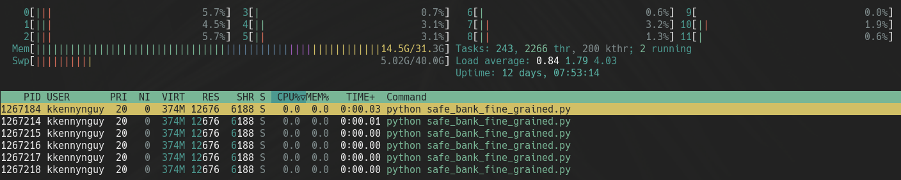


Let's put in some debugging print:
```py
def do_transfer(from_account: Account, to_account: Account, amount: int):
    if from_account.balance < amount:
        return

    print("taking first lock..")
    with from_account.lock:
        print("taking second lock...")
        with to_account.lock:
            from_account.balance -= amount
            time.sleep(0.000)
            to_account.balance += amount
        print("released second lock...")
    print("released first lock...")
```

Let's see:
```
$ python safe_bank_fine_grained.py
All good: Consistent account balance: $44,500
Starting transfers...
taking first lock..
taking second lock...
taking first lock..
taking second lock...
released second lock...
taking first lock..
released first lock...
released second lock...
taking first lock..
taking second lock...
released first lock...
taking first lock..
```

So.. we **never** got to taking the second lock after the last first lock taken. What's happening here? 

Let's consider this scenario. We have two transfers happening. Transfer 1 goes from A->B. Transfer 2 goes from B->A. What would happen is that both transfer would take its first lock, but stuck at taking the second lock, waiting indefinitely for the lock on the other thread to be released. Both of these, however, would release their first lock. These threads are in what we'd call a **deadlock** situation.

There is also another problem with the `validate_bank` function, where we are only taking out one lock:
```py
    with transfer_lock:
        current = sum(a.balance for a in accounts)
```

Now, we can't do that.. We have to 
```py
    [a.lock.acquire() for a in accounts]
    current = sum(a.balance for a in accounts)
    [a.lock.release() for a in accounts]
```

### Fixing the Deadlock

Fundamentally, the problem we are having is that different threads could take first a lock on A, then B while another thread could go B then A. It is the order of this lock acquisation that is the problem.

Let's say, if we could guarantee that all locks on A would be taken first, and then B, regardless whether they are `from_account` or `to_account`, that would solve our problem. Essentially, what we need to do is add some **ordering** to the lock aquisition process.

We could do this by using the python `id()` function to get the memory address of the pointer.
```
>>> variable = 123
>>> another_variable = 321
>>> id(variable)
139843497791536
>>> id(another_variable)
139843490992208
```

```py
def do_transfer(from_account: Account, to_account: Account, amount: int):
    if from_account.balance < amount:
        return

    lock1, lock2 = (
        (from_account.lock, to_account.lock)
        if id(from_account) < id(to_account)
        else (to_account.lock, from_account.lock)
    )

    with lock1:
        with lock2:
            from_account.balance -= amount
            time.sleep(0.000)
            to_account.balance += amount  
```

No more deadlock:
```
$ python safe_bank_fine_grained.py
All good: Consistent account balance: $44,500
Starting transfers...
Transfers complete (0.80) sec
All good: Consistent account balance: $44,500    
```

However, the program isn't faster... It's actually worse because of this block:
```py
def validate_bank(accounts: List[Account], total: int, quiet=False):
    [a.lock.acquire() for a in sorted(accounts, key=lambda x: id(x))]
    current = sum(a.balance for a in accounts)
    [a.lock.release() for a in accounts]
```

### Takeaways from fine-grained lock 

Taking fine-grained lock isn't always bad. We just need to think about what we want to do.

Most importantly, if we were taking two locks from two different things, we have to make sure to always take them **in the same order**, to avoid deadlocks.

```py
lock1, lock2 = (
    (from_account.lock, to_account.lock)
    if id(from_account) < id(to_account)
    else (to_account.lock, from_account.lock)
)
```
*(Note: Figure out a way to sort out the order.)*

A deadlock is a very, very shit place to be.

## Summary of Basic Thread Safety

```py
import threading

the_lock = threading.RLock()
# Always use Rlock() over Lock()

with the_lock:
    # do potentially unsafe operation(s)
```

# Multi-process parallelism

## Overview

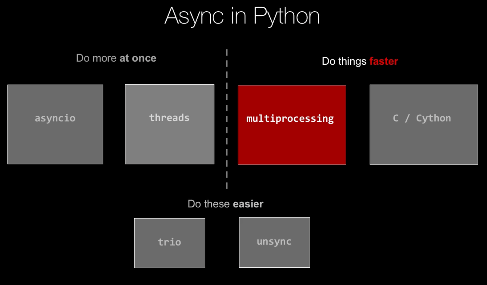

`multiprocessing` is very similar to `threads`, or the threading programming model. However with `multiprocessing`, each operation runs as an entirely separate Python process. 

`multiprocessing` bypasses the GIL by kicking off new Python processes with their own GIL that don't talk to one another.

## Example

This is the running of a program running threaded mode. It is doing some computational work (the details aren't super important).

```sh
$ python multiprocessing/compute_threaded.py
Doing math on 12 processors.
Done in 6.33 sec.
```

Let's convert this program to multiprocess programming.

First, we don't need the list of threads.
```py
    threads = []
```

We use `pool` instead. If we don't pass anything into `Pool()`, it will use by default up to `multiprocessing.cpu_count()` amount of cores.
```py
pool = multiprocessing.Pool()
```

Then, we call `apply_async()` from the `Pool` object.
```py
        task = pool.apply_async(do_math, (30_000_000 * (n - 1) / processor_count,
                                          30_000_000 * n / processor_count))
```

So this is actually going to start the work. We don't need to call `start()` on anything.

We then call `pool.close()` to say that no more work is coming. Then we call `pool.join()`, similarly to how we also have to join the threads.
### Result

```sh
$ python multiprocessing/compute_multiprocessing.py
Doing math on 12 processors.
Done in 2.57 sec.
```

BAM! This is a dramatic improvement.

## Core Concept - Scaling CPU-bound operations

```py
from multiprocessing.pool import Pool
```

First, we start by creating a new `Pool` instance:
```py
pool = Pool(processes=4)
```

Then, we start the work by calling `apply_sync()`
```py
pool.apply_sync(func=do_match, args=(0,100))
pool.apply_sync(func=do_match, args=(101,200))
pool.apply_sync(func=do_match, args=(201,300))
pool.apply_sync(func=do_match, args=(301,400))
```

Then, we have to call `close()` and then `join()`.

Important thing to remember is that this programming model will kick off separate Python processes that have their own GILs. This bypasses the individual GIL's restriction.

## Returning Values

We can capture the return values:
```py
    tasks = []
    for n in range(1, processor_count + 1):
        task = pool.apply_async(do_math, (30_000_000 * (n - 1) / processor_count,
                                          30_000_000 * n / processor_count))
        tasks.append(task)
```

Then, we can `get()` the result:
```py
    for t in tasks:
        print(t.get())
```
### Core Concept of returning values with `multiprpcessing`

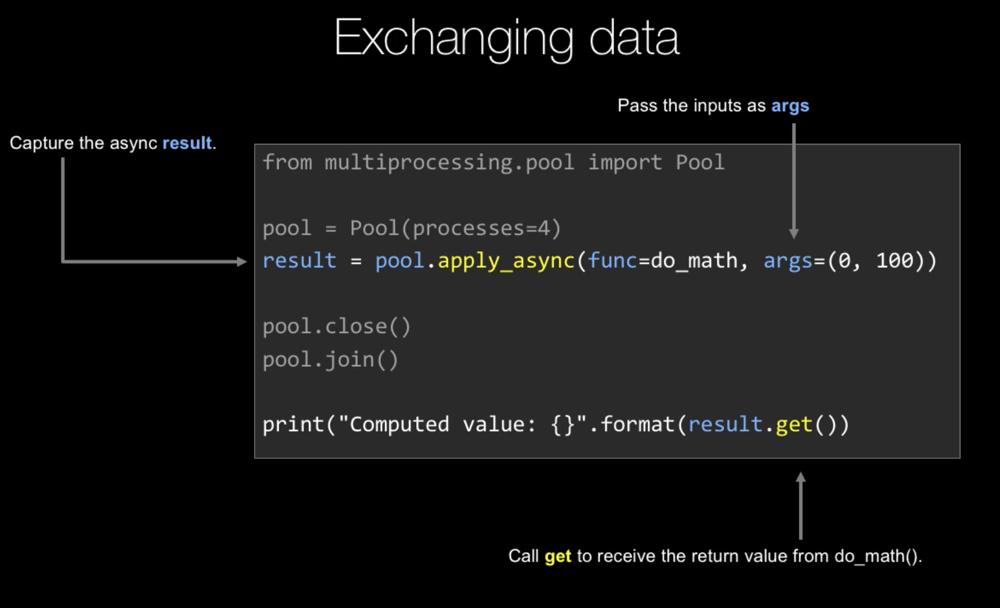

# Execution Pools

Let's talk about unifying the APIs of `threads` and `multiprocessing`. Although their APIs are different, it would be great if we could have a unified version of them two.

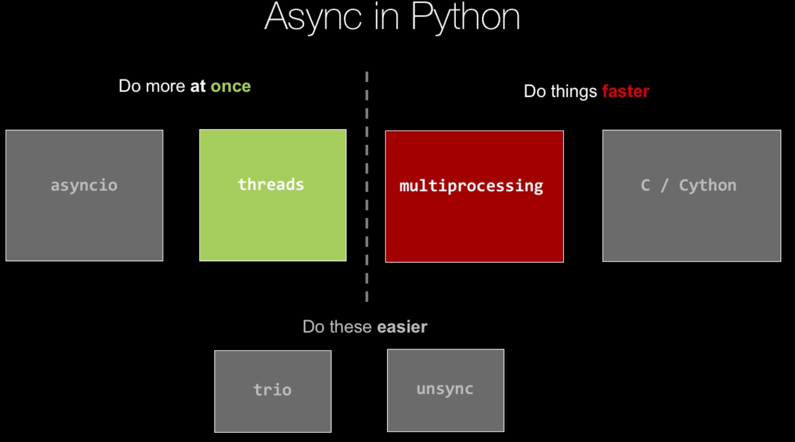

Let's blur the middle line separating these two. What if sometimes we want to use threading, and sometimes we also want to use multiprocessing to get around the GIL.

## Comparison: multithreading vs multiprocessing api

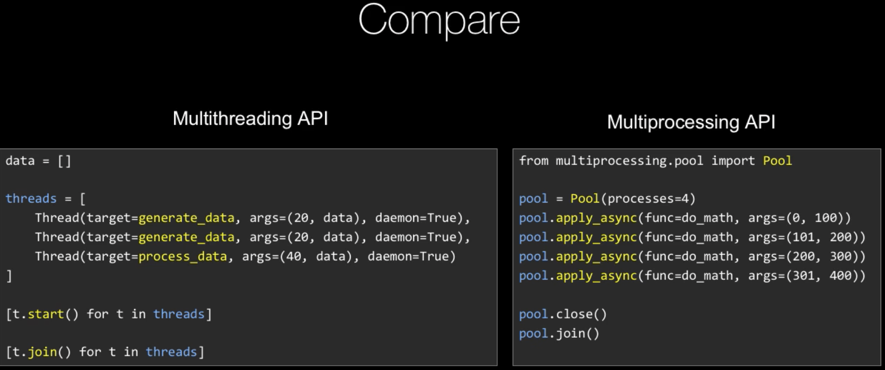

## Executor app
  
Starting with the synchronous programming version, in the main module we have the `get_title` function.


# Extending async patterns
# Async web frameworks
# Parallelism in C (with Cython)

# Notes

- Use `python3.10`
- 