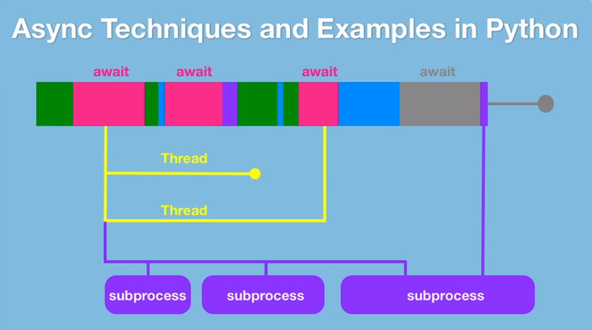
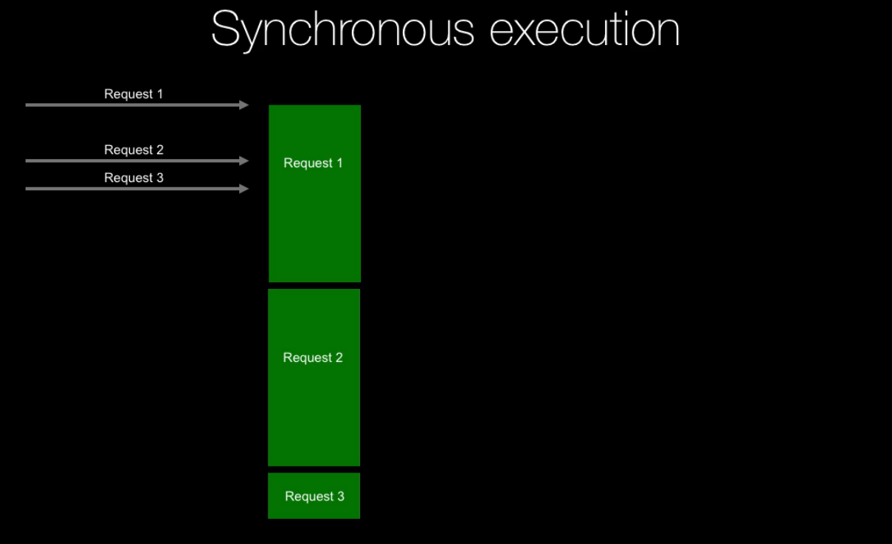
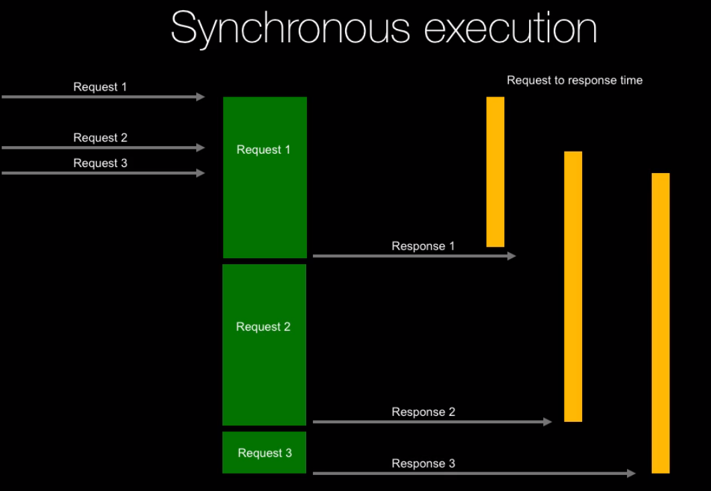
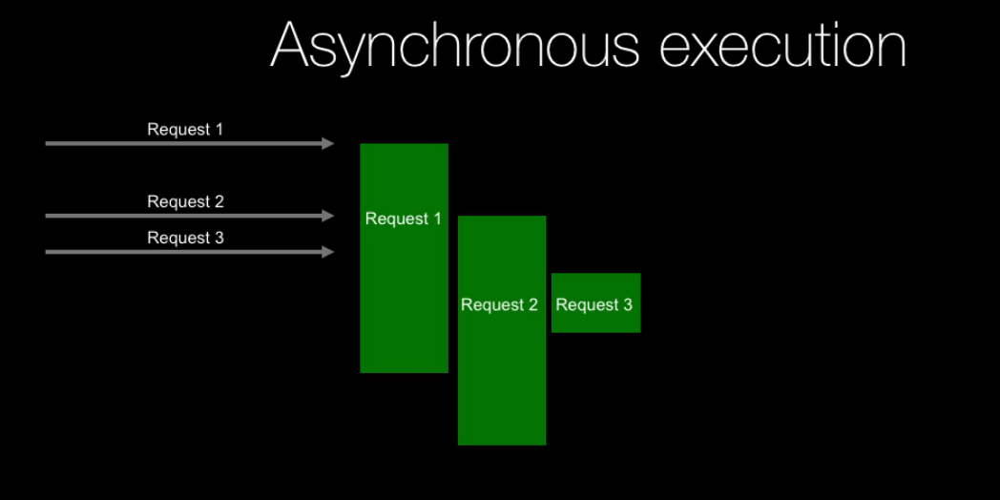
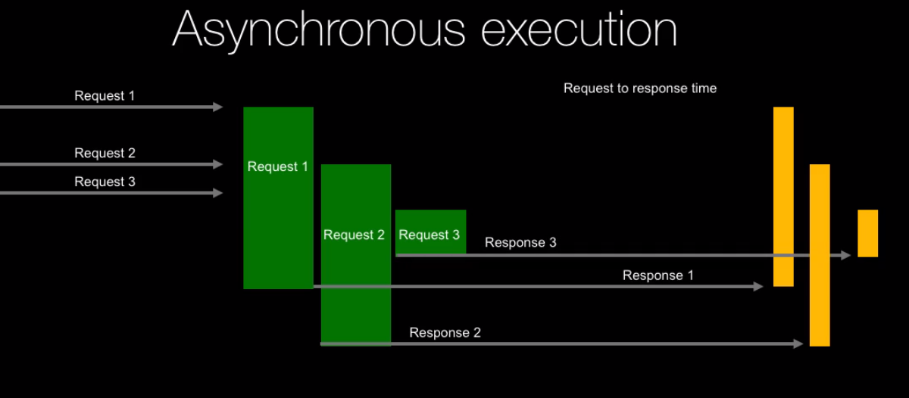
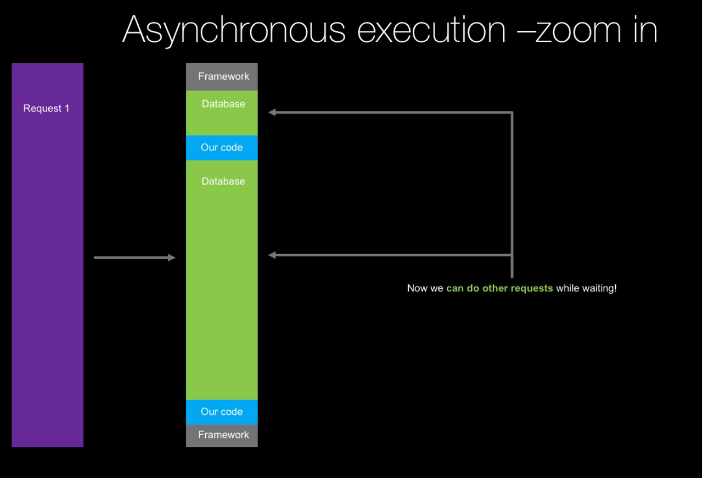
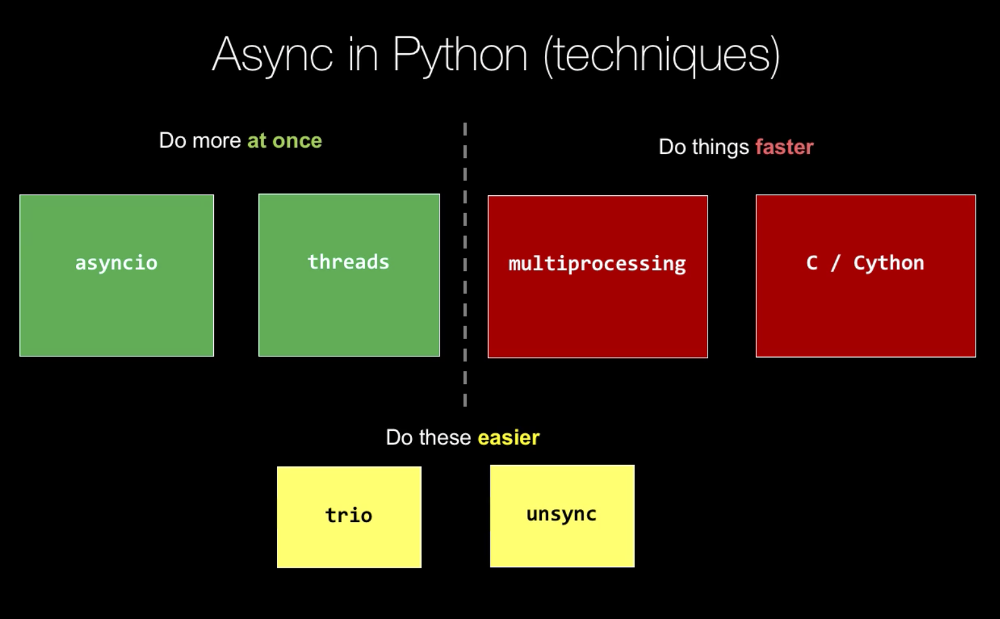
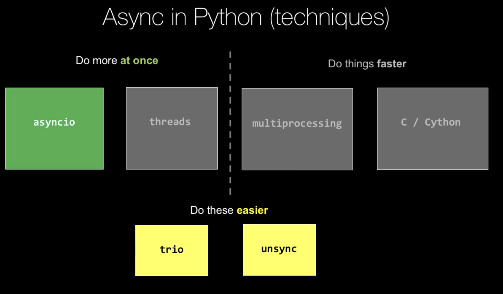
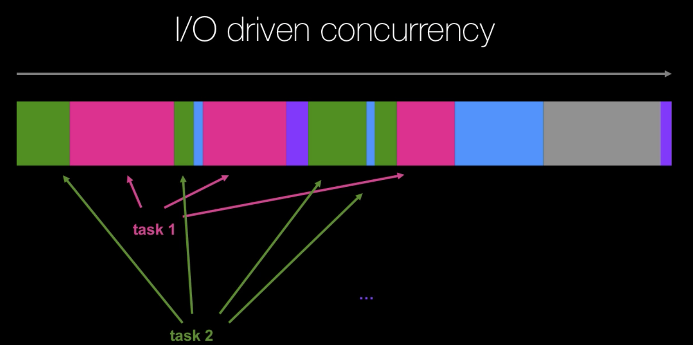

# Course Link

https://training.talkpython.fm/courses/details/async-in-python-with-threading-and-multiprocessing

# General



Definition of Asynchrony in Computer Programming:
> Asynchrony, in computer programming, refers to the occurrence of events independent of the main program flow and ways to deal with such events. 
> These may be "outside" events such as the arrival of signals, or actions instigated by a program that take place concurrently with program execution, without the program blocking to wait for results. 

Essentially it's "stuff happening at the same time".

# Why Async and When?

## Async for Performance/Speed


*(https://www.slideshare.net/Funk98/end-of-moores-law-or-a-change-to-something-else.)*

CPU isn't getting much faster. This is a hardware limitation. It's simply not possible to make smaller circuits in CPU, for thermal and inteference reasons. 

Instead of making the CPU cores faster, what we are doing is just adding more cores. If want to continue Moore's Law, and to take advantage of the processors that are being created these days, we have to write asynchronous code.

To take full advantage of today modern hardware, we have to target more than one CPU cores. The only way to do that is to do things **in parallel**.

If we have anything that is computational and we want to do it as fast as possible using modern hardware, we have to use asynchronous programming.

If we only write our programs synchronously, this is as much utilization as it is going to get:


< 10% of the system CPU, due to the limitation within a single thread.

## Note on upper bound for improvement

Most programs don't scale linearly to the number of cores running on the system. Adding parallelism won't simply speed up the program by X, where X is the number of CPU cores.

Not all of the program execution can be made faster by adding concurrency. Only some are:


In this case, the overall performance boost is at max 20%.

The real question to ask yourself, before introducing any concurrency is: How much can actually be made faster with concurrency? Is it worth the effort and complexity?

What is the upper bound for improvement? There is **always** an upper bound for improvement.

## Async for Scalability

What is scalability? In the context of a website, scalability does not refer to how fast we can handle an individual request. It refers to how many requests can your system handle, until **its performances degrades**.

In fact, as we add scalability to the system, we may actually make it slower to handle individual requests.

Let's visualise three requests being handled/executed in a synchronous fashion, one after another:



In term of execution time, Request 1 and 2 looks relatively similar. Request 3 can definitely be seen as taking less execution time.

However, from the outside world, here is what it appears like:



From the outside world, it took a terribly long time to get a response from Request 3!

If we zoom in to the lower level of how a request is handled, in a world where everything happens synchronously, there is a lot of waiting:


If we could find a way to process Request 2 and Request 3 while waiting for the database trip (red), we could really ramp up scalability.

Let's now visualise the same situation, now with asynchronous execution:



Response time:



Request 3 reaps the most benefit from adding concurrency.

How would we do this at the lower level? During the database trip one request, we could simply start doing other requests, and so on.



## Async techniques in Python - The Landsacape

There are many different techniques that we'll go through in this course, and these can be applied in different situations. Each technique has their own pros and cons.

However, there are essentially two main "schools" of async techniques in Python, and these are:
- Do more **at once**.
*(similar to the web server example just above.)*
- Do things **faster**.
*(faster computation)*



`trio` and `unsync` are higher level libraries.

## Why threads don't perform in Python - The GIL

Threads in Python don't really perform well. They are fine with waiting, but really don't help for computational work.

Remember the Python program with the `while loop` during which `x+=1`? If we added 12 threads for that, we'd have only gotten 0% gain. 

The reason for this is the **GIL** - **Global Interpreter Lock**. This is essentially why people say Python isn't fast and/or scalable. This is Python's **memory management feature**. This is a thread-safety feature. Without this GIL, Python would run slower on single thread.

The GIL means only one thread, or only one step of execution in Python can ever run at the same time regardless of them being on the same thread, or on multiple different threads. **Only one Python instruction at a time**, no matter where they come from, at any given time.

# async and await (`asyncio`) - Concurrency without threads, without subprocesses

That's right. No threads. No subprocesses.

This is `asyncio`. It helps do **more** at once.



## (Not) Typical Concurrent Programming

The following demonstrates the typical conceptualiation of concurrent programming. 


We have some code running. Then we want to do multiple things at a time. We'd run some code AND kick off some other threads. Then our main thread and all the other threads will run until all the threads have finished with their work. Then, the code continue to be executed in the same direction.

This is typically done with threads, or multiprocessing. This makes a lot of sense.

In the `asyncio` world, this typical concurrent programming doesn't actually happen. Something entirely different happens.

In this `asyncio` world, we are depending on the operating system to schedule the threads, or the processes and manage the concurrency. It's called pre-emptive multiprocessing. It is ultimately the OS job to make sure concurrency happens.
### I/O driven concurrency

In I/O driven concurrency, we don't have multiple threads. We have just one, running along. One thread managing this parallelism.

Typically in a typical concurrent programming, we'd try to do multiple things on multiple threads. 

If we could take those multiple things, and interweaving them together, switching one after another, it would feel just the same.



**The points at which these tasks are broken up** are typically where we are waiting for a database process, calling a web service..etc.. doing anything that essentially involves an external system.

TBH, this isn't true parallelism but more like "efficient programming", doing things during the times where we'd otherwise not do anything apart from waiting. 

This is the underlying programming model of `asyncio` and the `await` keyword. It is also called "Co-operative Multithreading" because it is upto our code to tell the program when to wait (using `await`).

This is also the **easiest** style of parallelism.

### Simple Fibonacci example

> The Fibonacci sequence is a series of numbers in which each number is the sum of the two that precede it. Starting at 0 and 1, the sequence looks like this: 0, 1, 1, 2, 3, 5, 8, 13, 21, 34, and so on forever.
> The Fibonacci sequence can be described using a mathematical equation: Xn+2= Xn+1 + Xn.

```python
from typing import List


def fib(n: int) -> List[int]:
    numbers = []
    current, nxt = 0, 1
    while len(numbers) < n:
        current, nxt = nxt, current + nxt
        numbers.append(current)
    
    return numbers

print(fib(10))
# [1, 1, 2, 3, 5, 8, 13, 21, 34, 55]
```

The Fibonacci sequence is infinite. By specifying an input, we are limiting this to a finite set. 

What if we don't want that finite set, but rather work through all the numbers, and see if any of them meet a specific condition? In that case, we can't really specify an input.

What would be good is that the **consumer** of this generate infinite fib numbers decides when they have had enough. We can do that with a generator.

```py
def fib(n:int) -> Iterator[int]:
    current, nxt = 0,1
    while True:
        curent, nxt = next, current + nxt
        yield current

for n in fib():
    print(n, end = ', ')
    if n > 10000:
        break

# 1, 1, 2, 3, 5, 8, 13, 21, 34, 55, 89, 144, 233, 377, 610, 987, 1597, 2584, 4181, 6765, 10946, %
```

Understanding the ideal behind generator is key in understanding how `asyncio` works. Generators are "restartable functions". 

If we just call a function that outputs a generator, it wouldn't run. The genarator would only start generating when we actually pull on it, like `print()`.

If we use a debugger to step through the above code, we'd see that within the actual loop, the python interpreter never steps through the `def fib()`, but it goes straigh into the loop within the function. That's an important thing to understand.

They are also **restartable**, which means that we can run it, pause, then resume. There is no parallelism going on. But you can build pretty good co-operative parallelism with generator functions.

## The producer-consumer app

This is a common pattern. The idea is that there are some parts of the system that typically run independently and asynchronously. 

One generates an item (generate a report, send this email, trigger this alert). This is the **producer**.

There's another part of the system that's running asynchronously that looks for work to be done. This is the **consumer**. It picks up these jobs that have been created by the producer and starts working on them.


# Multi-threaded parallelism
# Thread Safety
# Multi-process parallelism
# Execution Pools
# Extending async patterns
# Async web frameworks
# Parallelism in C (with Cython)

