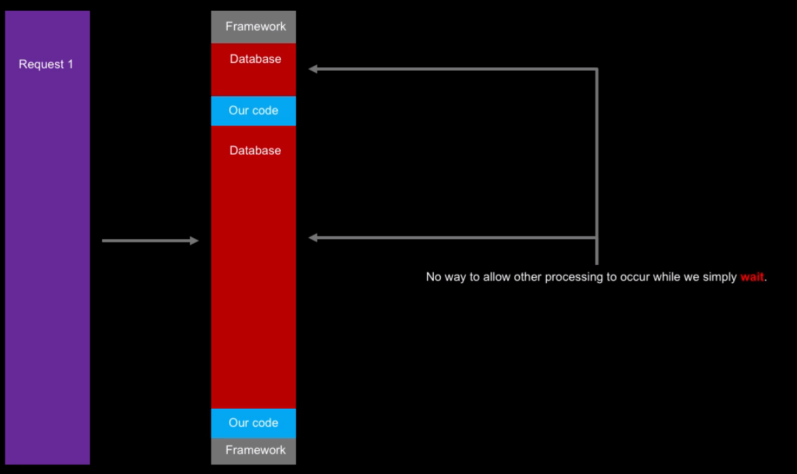
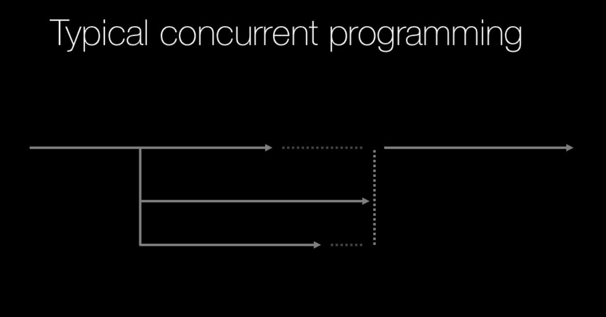

- [General](#general)
- [Why Async and When?](#why-async-and-when)
  - [Async for Performance/Speed](#async-for-performancespeed)
  - [Note on upper bound for improvement](#note-on-upper-bound-for-improvement)
  - [Async for Scalability](#async-for-scalability)
  - [Async techniques in Python - The Landsacape](#async-techniques-in-python---the-landsacape)
  - [Why threads don't perform in Python - The GIL](#why-threads-dont-perform-in-python---the-gil)
- [async and await (`asyncio`) - Concurrency without threads, without subprocesses](#async-and-await-asyncio---concurrency-without-threads-without-subprocesses)
  - [(Not) Typical Concurrent Programming](#not-typical-concurrent-programming)
    - [I/O driven concurrency](#io-driven-concurrency)
    - [Simple Fibonacci example](#simple-fibonacci-example)
  - [The producer-consumer app](#the-producer-consumer-app)
    - [Synchronous App](#synchronous-app)
    - [Asynchronous App](#asynchronous-app)
      - [The loop](#the-loop)
      - [The Queue](#the-queue)
      - [Tasks in the loop; and the final task](#tasks-in-the-loop-and-the-final-task)
      - [async function](#async-function)
      - [The beautiful thing about using `asyncio`](#the-beautiful-thing-about-using-asyncio)
      - [Summary](#summary)
    - [Anatomy of an async method](#anatomy-of-an-async-method)
  - [`uvloop` - super easy performance gain](#uvloop---super-easy-performance-gain)
  - [Let's do some real work - web scraping with `aiohttp`](#lets-do-some-real-work---web-scraping-with-aiohttp)
  - [Other async capable libraries](#other-async-capable-libraries)
- [Threads & Multi-threaded parallelism](#threads--multi-threaded-parallelism)
- [Thread Safety](#thread-safety)
- [Multi-process parallelism](#multi-process-parallelism)
- [Execution Pools](#execution-pools)
- [Extending async patterns](#extending-async-patterns)
- [Async web frameworks](#async-web-frameworks)
- [Parallelism in C (with Cython)](#parallelism-in-c-with-cython)
- [Notes](#notes)
# General


Definition of Asynchrony in Computer Programming:
> Asynchrony, in computer programming, refers to the occurrence of events independent of the main program flow and ways to deal with such events. 
> These may be "outside" events such as the arrival of signals, or actions instigated by a program that take place concurrently with program execution, without the program blocking to wait for results. 

Essentially it's "stuff happening at the same time".

# Why Async and When?

## Async for Performance/Speed


*(https://www.slideshare.net/Funk98/end-of-moores-law-or-a-change-to-something-else.)*

CPU isn't getting much faster. This is a hardware limitation. It's simply not possible to make smaller circuits in CPU, for thermal and inteference reasons. 

Instead of making the CPU cores faster, what we are doing is just adding more cores. If want to continue Moore's Law, and to take advantage of the processors that are being created these days, we have to write asynchronous code.

To take full advantage of today modern hardware, we have to target more than one CPU cores. The only way to do that is to do things **in parallel**.

If we have anything that is computational and we want to do it as fast as possible using modern hardware, we have to use asynchronous programming.

If we only write our programs synchronously, this is as much utilization as it is going to get:


< 10% of the system CPU, due to the limitation within a single thread.

## Note on upper bound for improvement

Most programs don't scale linearly to the number of cores running on the system. Adding parallelism won't simply speed up the program by X, where X is the number of CPU cores.

Not all of the program execution can be made faster by adding concurrency. Only some are:


In this case, the overall performance boost is at max 20%.

The real question to ask yourself, before introducing any concurrency is: How much can actually be made faster with concurrency? Is it worth the effort and complexity?

What is the upper bound for improvement? There is **always** an upper bound for improvement.

## Async for Scalability

What is scalability? In the context of a website, scalability does not refer to how fast we can handle an individual request. It refers to how many requests can your system handle, until **its performances degrades**.

In fact, as we add scalability to the system, we may actually make it slower to handle individual requests.

Let's visualise three requests being handled/executed in a synchronous fashion, one after another:


In term of execution time, Request 1 and 2 looks relatively similar. Request 3 can definitely be seen as taking less execution time.

However, from the outside world, here is what it appears like:


From the outside world, it took a terribly long time to get a response from Request 3!

If we zoom in to the lower level of how a request is handled, in a world where everything happens synchronously, there is a lot of waiting:



If we could find a way to process Request 2 and Request 3 while waiting for the database trip (red), we could really ramp up scalability.

Let's now visualise the same situation, now with asynchronous execution:


Response time:


Request 3 reaps the most benefit from adding concurrency.

How would we do this at the lower level? During the database trip one request, we could simply start doing other requests, and so on.


## Async techniques in Python - The Landsacape

There are many different techniques that we'll go through in this course, and these can be applied in different situations. Each technique has their own pros and cons.

However, there are essentially two main "schools" of async techniques in Python, and these are:
- Do more **at once**.
*(similar to the web server example just above.)*
- Do things **faster**.
*(faster computation)*


`trio` and `unsync` are higher level libraries.

## Why threads don't perform in Python - The GIL

Threads in Python don't really perform well. They are fine with waiting, but really don't help for computational work.

Remember the Python program with the `while loop` during which `x+=1`? If we added 12 threads for that, we'd have only gotten 0% gain. 

The reason for this is the **GIL** - **Global Interpreter Lock**. This is essentially why people say Python isn't fast and/or scalable. This is Python's **memory management feature**. This is a thread-safety feature. Without this GIL, Python would run slower on single thread.

The GIL means only one thread, or only one step of execution in Python can ever run at the same time regardless of them being on the same thread, or on multiple different threads. **Only one Python instruction at a time**, no matter where they come from, at any given time.

# async and await (`asyncio`) - Concurrency without threads, without subprocesses

That's right. No threads. No subprocesses.

This is `asyncio`. It helps do **more** at once.


## (Not) Typical Concurrent Programming

The following demonstrates the typical conceptualiation of concurrent programming. 



We have some code running. Then we want to do multiple things at a time. We'd run some code AND kick off some other threads. Then our main thread and all the other threads will run until all the threads have finished with their work. Then, the code continue to be executed in the same direction.

This is typically done with threads, or multiprocessing. This makes a lot of sense.

In the `asyncio` world, this typical concurrent programming doesn't actually happen. Something entirely different happens.

In this `asyncio` world, we are depending on the operating system to schedule the threads, or the processes and manage the concurrency. It's called pre-emptive multiprocessing. It is ultimately the OS job to make sure concurrency happens.
### I/O driven concurrency

In I/O driven concurrency, we don't have multiple threads. We have just one, running along. One thread managing this parallelism.

Typically in a typical concurrent programming, we'd try to do multiple things on multiple threads. 

If we could take those multiple things, and interweaving them together, switching one after another, it would feel just the same.


**The points at which these tasks are broken up** are typically where we are waiting for a database process, calling a web service..etc.. doing anything that essentially involves an external system.

TBH, this isn't true parallelism but more like "efficient programming", doing things during the times where we'd otherwise not do anything apart from waiting. 

This is the underlying programming model of `asyncio` and the `await` keyword. It is also called "Co-operative Multithreading" because it is upto our code to tell the program when to wait (using `await`).

This is also the **easiest** style of parallelism.

### Simple Fibonacci example

> The Fibonacci sequence is a series of numbers in which each number is the sum of the two that precede it. Starting at 0 and 1, the sequence looks like this: 0, 1, 1, 2, 3, 5, 8, 13, 21, 34, and so on forever.
> The Fibonacci sequence can be described using a mathematical equation: Xn+2= Xn+1 + Xn.

```python
from typing import List


def fib(n: int) -> List[int]:
    numbers = []
    current, nxt = 0, 1
    while len(numbers) < n:
        current, nxt = nxt, current + nxt
        numbers.append(current)
    
    return numbers

print(fib(10))
# [1, 1, 2, 3, 5, 8, 13, 21, 34, 55]
```

The Fibonacci sequence is infinite. By specifying an input, we are limiting this to a finite set. 

What if we don't want that finite set, but rather work through all the numbers, and see if any of them meet a specific condition? In that case, we can't really specify an input.

What would be good is that the **consumer** of this generate infinite fib numbers decides when they have had enough. We can do that with a generator.

```py
def fib(n:int) -> Iterator[int]:
    current, nxt = 0,1
    while True:
        curent, nxt = next, current + nxt
        yield current

for n in fib():
    print(n, end = ', ')
    if n > 10000:
        break

# 1, 1, 2, 3, 5, 8, 13, 21, 34, 55, 89, 144, 233, 377, 610, 987, 1597, 2584, 4181, 6765, 10946, %
```

Understanding the ideal behind generator is key in understanding how `asyncio` works. Generators are "restartable functions". 

If we just call a function that outputs a generator, it wouldn't run. The genarator would only start generating when we actually pull on it, like `print()`.

If we use a debugger to step through the above code, we'd see that within the actual loop, the python interpreter never steps through the `def fib()`, but it goes straigh into the loop within the function. That's an important thing to understand.

They are also **restartable**, which means that we can run it, pause, then resume. There is no parallelism going on. But you can build pretty good co-operative parallelism with generator functions.

## The producer-consumer app

This is a common pattern. The idea is that there are some parts of the system that typically run independently and asynchronously. 

One generates an item (generate a report, send this email, trigger this alert). This is the **producer**.

There's another part of the system that's running asynchronously that looks for work to be done. This is the **consumer**. It picks up these jobs that have been created by the producer and starts working on them.

### Synchronous App


The producer and the consumer are working synchronously. As such, the consumer doesn't get to consume until 20 second mark.

```py
    generate_data(20, data)
    process_data(20, data)
```

The overall time it took to run was 30.60 sec.

We could improve this tremendously by using `asyncio`.

### Asynchronous App

There are a couple of things we need to do to make a program asynchronous. 

Syntactically simple but conceptually complex.

#### The loop

In order to run asynchronous code routine, we can't just call them like a normal function. We have to call them in an asyncio loop. That asyncio loop is going to execute on whatever thread or environment that we started on. It is **our** job to create and run that loop.
```py
loop = asyncio.new_event_loop()
```

Later on, this loop is set to run until complete
```py
    loop.run_until_complete(something_we_need_to_pass_in)
```

What is going into the function? Essentially the functions that we want to run asynchronously until completed.

We also need to change the type of data that we need to use. Right now we have a list.
```py
data = []
```

#### The Queue

We can use a list. But `asyncio` has a way to deal with this better.
```py
data = asyncio.Queue()
```

A queue is cool. Something goes in something comes out. FIFO.

A queue allows us to wait and tell `asyncio` to continue doing other work, until something comes in this queue, then wakes up/ resume the code routine and get it running.

Wih this new `Queue` type, we also change the way we interact with it. `append` is now `put` and `pop` is new `get`.

Then, we are going to kick the execution of `generate_data` and `process_data` separately together, then put it to `run_until_complete()`.

#### Tasks in the loop; and the final task

We need to create the tasks in the loop.
```py
task1 = loop.create_task(generate_data(20, data))
task2 = loop.create_task(produce_data(20, data))
```
 
The `run_until_complete()` takes a single thing to run. This thing is of type `future`.
```py
final_task = asyncio.gather([task1, task2])
```

Then..
```py
loop.run_until_complete(final_task)
```

That is the execution level code. However we don't yet have async code routine down below.

So our next task is to convert those functions into async code routine.

#### async function

How do we adapt the two functions to `asyncio`?

There are two things that we need to do to make a synchronous code routine asynchonous.

We have to mark the method as an `async` method.
```py
async def generate_data(num: int, data: asyncio.Queue):
```

This is just the function signature. It doesn't actually matter. Just because the code says it is async, doesn't mean that it will run async.

We have to actually convert the logic to async by breaking it down to little pieces of unit and the dividing point are "Where are we waiting?", "What are we waiting on?".

The most obvious answer to "Where are we waiting?" is at `time.sleep()`. We don't want to do `time.sleep()`.

There is a better way to say "I am done with my work, I am going to take a rest for a while, you can keep working" by `asyncio.sleep()`.

You also have to use `await` in front of the async operation. This will break up the code into little slices.
```py
async def generate_data(num: int, data: asyncio.Queue):
    for idx in range(1, num + 1):
        item = idx*idx
        await data.put((item, datetime.datetime.now()))

        print(colorama.Fore.YELLOW + f" -- generated item {idx}", flush=True)
        await asyncio.sleep(random.random() + .5)
```


Because the consumer is much faster than the producer, or the produce isn't producing as fast as the consumer can consume, we keep seeing `0.00 sec`.

So let's make one change, let's have two producers and make the consumers expect more inputs.


The execution time of 22 seconds would have been 50 if this routine was done synchronously.

#### The beautiful thing about using `asyncio`

All we had to was to break up these functions into parts where we are waiting on something else. 

We did't have to change our programming model at all. This is the most important thing. We are using the exact same code.

The programming model is still the synchronous model we use. 

#### Summary

In summary, here is what we did:
```
1. Create a loop
2. Create tasks
3. Run the tasks until they complete
```

The improvement in the `after` latency time is insane.
```
 -- generated item 16
 -- generated item 17
 -- generated item 18
 -- generated item 19
 -- generated item 20
 +++ Processed value 1 after 20.49 sec.
 +++ Processed value 4 after 19.61 sec.
 +++ Processed value 9 after 18.87 sec.
 +++ Processed value 16 after 18.39 sec.
 +++ Processed value 25 after 17.70 sec.
 +++ Processed value 36 after 17.13 sec.
 +++ Processed value 49 after 16.24 sec.
 +++ Processed value 64 after 15.40 sec.
 +++ Processed value 81 after 15.37 sec.
 +++ Processed value 100 after 14.82 sec.
 +++ Processed value 121 after 14.49 sec.
 +++ Processed value 144 after 13.72 sec.
 +++ Processed value 169 after 13.47 sec.
 +++ Processed value 196 after 13.35 sec.
 +++ Processed value 225 after 12.73 sec.
 +++ Processed value 256 after 12.36 sec.
 +++ Processed value 289 after 12.07 sec.
 +++ Processed value 324 after 11.24 sec.
 +++ Processed value 361 after 11.01 sec.
 +++ Processed value 400 after 10.11 sec.
```

versus

```
 -- generated item 15
 +++ Processed value 225 after 0.88 sec.
 -- generated item 16
 +++ Processed value 225 after 0.52 sec.
 -- generated item 16
 +++ Processed value 256 after 0.66 sec.
 -- generated item 17
 -- generated item 17
 +++ Processed value 256 after 0.95 sec.
 -- generated item 18
 +++ Processed value 289 after 0.89 sec.
 +++ Processed value 289 after 1.04 sec.
 -- generated item 18
 +++ Processed value 324 after 1.20 sec.
 -- generated item 19
```
### Anatomy of an async method


## `uvloop` - super easy performance gain

> uvloop is a fast, drop-in replacement of the built-in asyncio event loop. uvloop is implemented in Cython and uses libuv under the hood.
> *https://github.com/MagicStack/uvloop*

`uvloop` is a re-implementation of the `asyncio` event loop.

Due to the way that Python works, the `async` `await` keyword can be used with different implementations of event loops. `uvloop` is one of those. 

`uvloop` makes `asyncio` 2-4x faster. 

See here:
```
$ python loops/loops_asyncio/loop_program.py 
Running standard loop with 500,000 actions.

$ python loops/loops_uv/loop_program_uv.py 
Running standard loop with 500,000 actions.
App exiting, total time: 1.77 sec.  
```

Let's inspect this program, implemented using `asyncio` event loop.
```py
$ bat loops/loops_asyncio/loop_program.py   
       File: loops/loops_asyncio/loop_program.py
   1   import datetime
   2   import colorama
   3   import asyncio
   4   
   5   
   6   def main():
   7       lim = 250_000
   8       print(f"Running standard loop with {lim * 2:,} actions.")
   9       t0 = datetime.datetime.now()
  10   
  11       # Changed this from the video due to changes in Python 3.10:
  12       # DeprecationWarning: There is no current event loop, loop = asyncio.get_event_loop()
  13       loop = asyncio.new_event_loop()
  14   
  15       data = asyncio.Queue()
  16   
  17       task1 = loop.create_task(generate_data(lim, data))
  18       task3 = loop.create_task(generate_data(lim, data))
  19       task2 = loop.create_task(process_data(2 * lim, data))
  20   
  21       final_task = asyncio.gather(task1, task2, task3)
  22       loop.run_until_complete(final_task)
  23   
  24       dt = datetime.datetime.now() - t0
  25       print(colorama.Fore.WHITE + f"App exiting, total time: {dt.total_seconds():,.2f} sec.", flush=True)
  26   
  27   
  28   async def generate_data(num: int, data: asyncio.Queue):
  29       for idx in range(1, num + 1):
  30           item = idx * idx
  31           await data.put((item, datetime.datetime.now()))
  32           await asyncio.sleep(0)
  33   
  34   
  35   async def process_data(num: int, data: asyncio.Queue):
  36       processed = 0
  37       while processed < num:
  38           await data.get()
  39           processed += 1
  40           await asyncio.sleep(0)
  41   
  42   
  43   if __name__ == '__main__':
  44       main()    
```

We are not sleeping much (L32). Essentially, we are just telling the program to "give up" the time slice, let something else run, and immediately pick up and keep going. 

We are doing this 250,000 times each task, so 1,000,000 times in total.

Re-implementing this using `uvloop` event loop is relatively simple:
```py
import uvloop

asyncio.set_event_loop_policy(uvloop.EventLoopPolicy())
```

All you need to do is import `uvloop` into the module, and ask `asyncio` to use `uvloop` event loop implementation when creating event loop.

## Let's do some real work - web scraping with `aiohttp`

In `asyncio/web_scraping/sync_scrape/program.py`, we are scraping the HTML and title of some HTML pages.

```py
$ python web_scraping/sync_scrape/program.py     
Getting HTML for episode 150
Getting TITLE for episode 150
Title found: Technical Lessons Learned from Pythonic Refactoring
Getting HTML for episode 151
Getting TITLE for episode 151
Title found: Gradual Typing of Production Applications
Getting HTML for episode 152
Getting TITLE for episode 152
Title found: Understanding and using Python's AST
Getting HTML for episode 153
Getting TITLE for episode 153
Title found: How Python Evolves
Getting HTML for episode 154
Getting TITLE for episode 154
Title found: Python in Biology and Genomics
Getting HTML for episode 155
Getting TITLE for episode 155
Title found: Practical steps for moving to Python 3
Getting HTML for episode 156
Getting TITLE for episode 156
Title found: Python History and Perspectives
Getting HTML for episode 157
Getting TITLE for episode 157
Title found: The Journal of Open Source Software
Getting HTML for episode 158
Getting TITLE for episode 158
Title found: Quantum Computing and Python
Getting HTML for episode 159
Getting TITLE for episode 159
Title found: Inside the new PyPI launch
Done in 9.68 sec.  
```

Let's convert this synchronous function to run asynchronously.

First, in order for us to start writing async code, we need to implement a library that actually supports `asyncio`. These are libraries that have asynhronous methods and code routines that we can `await`.

For our example, let's look at `aiohttp`, to be implemented in place of `requests`.

Here are the packages we need:
```
asyncio
asyncdns
cchardet
```

Let's have a stab:
```py
import asyncio
import datetime

import aiohttp
import bs4
from colorama import Fore


async def get_html(episode_number: int) -> str:
    print(Fore.YELLOW + f"Getting HTML for episode {episode_number}", flush=True)

    url = f"https://talkpython.fm/{episode_number}"

    async with aiohttp.ClientSession() as session:
        async with session.get(url) as resp:
            resp.raise_for_status()
            return await resp.text()


def get_title(html: str, episode_number: int) -> str:
    print(Fore.CYAN + f"Getting TITLE for episode {episode_number}", flush=True)
    soup = bs4.BeautifulSoup(html, "html.parser")
    header = soup.select_one("h1")
    if not header:
        return "MISSING"

    return header.text.strip()


def main():
    t0 = datetime.datetime.now()

    loop = asyncio.get_event_loop()
    loop.run_until_complete(get_title_range())

    dt = datetime.datetime.now() - t0
    print(f"Done in {dt.total_seconds():.2f} sec.")


async def get_title_range():
    # Please keep this range pretty small to not DDoS my site. ;)
    for n in range(150, 160):
        html = await get_html(n)
        title = get_title(html, n)
        print(Fore.WHITE + f"Title found: {title}", flush=True)


if __name__ == "__main__":
    main()
```

The `async with` is an extension of Python's existing context manager.

When we run this program, there is no improvement in speed..
```
$ python web_scraping/async_scrape/program.py
/home/kkennynguyen/deve/async-techniques-python/asyncio/web_scraping/async_scrape/program.py:33: DeprecationWarning: There is no current event loop
  loop = asyncio.get_event_loop()
Getting HTML for episode 150
Getting TITLE for episode 150
Title found: Technical Lessons Learned from Pythonic Refactoring
Getting HTML for episode 151
Getting TITLE for episode 151
Title found: Gradual Typing of Production Applications
Getting HTML for episode 152
Getting TITLE for episode 152
Title found: Understanding and using Python's AST
Getting HTML for episode 153
Getting TITLE for episode 153
Title found: How Python Evolves
Getting HTML for episode 154
Getting TITLE for episode 154
Title found: Python in Biology and Genomics
Getting HTML for episode 155
Getting TITLE for episode 155
Title found: Practical steps for moving to Python 3
Getting HTML for episode 156
Getting TITLE for episode 156
Title found: Python History and Perspectives
Getting HTML for episode 157
Getting TITLE for episode 157
Title found: The Journal of Open Source Software
Getting HTML for episode 158
Getting TITLE for episode 158
Title found: Quantum Computing and Python
Getting HTML for episode 159
Getting TITLE for episode 159
Title found: Inside the new PyPI launch
Done in 9.53 sec.  
```

Why? Look here:
```py
async def get_title_range():
    # Please keep this range pretty small to not DDoS my site. ;)
    for n in range(150, 160):
        html = await get_html(n)
        title = get_title(html, n)
        print(Fore.WHITE + f"Title found: {title}", flush=True)

```

We are only doing one thing at a time. What we want is to **start all the requests**, and THEN process the responses as they come in.

Let's re-implement this:
```py
async def get_title_range():
    tasks = []

    # Start ALL the requests at once
    for n in range(150, 160):
        tasks.append((n, asyncio.create_task(get_html(n))))

    # Process all the requests, as they come in
    for n, t in tasks:
        html = await t
        title = get_title(html, n)
        print(Fore.WHITE + f"Title found: {title}", flush=True)
```

```
$ python web_scraping/async_scrape/program.py
/home/kkennynguyen/deve/async-techniques-python/asyncio/web_scraping/async_scrape/program.py:33: DeprecationWarning: There is no current event loop
  loop = asyncio.get_event_loop()
Getting HTML for episode 150
Getting HTML for episode 151
Getting HTML for episode 152
Getting HTML for episode 153
Getting HTML for episode 154
Getting HTML for episode 155
Getting HTML for episode 156
Getting HTML for episode 157
Getting HTML for episode 158
Getting HTML for episode 159
Getting TITLE for episode 150
Title found: Technical Lessons Learned from Pythonic Refactoring
Getting TITLE for episode 151
Title found: Gradual Typing of Production Applications
Getting TITLE for episode 152
Title found: Understanding and using Python's AST
Getting TITLE for episode 153
Title found: How Python Evolves
Getting TITLE for episode 154
Title found: Python in Biology and Genomics
Getting TITLE for episode 155
Title found: Practical steps for moving to Python 3
Getting TITLE for episode 156
Title found: Python History and Perspectives
Getting TITLE for episode 157
Title found: The Journal of Open Source Software
Getting TITLE for episode 158
Title found: Quantum Computing and Python
Getting TITLE for episode 159
Title found: Inside the new PyPI launch
Done in 1.36 sec.  
```

The performance improvement here is pretty crazy. 

One important note is that if the number of tasks that we launch is significantly higher, we might want to implement some sort of rate-limitting, not to let the tasks get out of control.

## Other async capable libraries

If we want to take advantage of asynchronous programming, it is critical that the libraries that we are using, to talk to various external systems, provide asynchronous methods. 


- `aiofiles` for file system. This library enables starting asynchronous job streams for read/write operation of system files.
- `umongo` enables asynchronous operations when interacting with MongoDB. It is a very cool library that is feature rich.
- `asyncpg` is a fast PostgreSQL database client library.
- `asyncio-redis` can be used with Redis, which in turn is normally used for in-memory cache.

# Threads & Multi-threaded parallelism

Using threads is one of the main way to add concurrency to Python programs.


# Thread Safety
# Multi-process parallelism
# Execution Pools
# Extending async patterns
# Async web frameworks
# Parallelism in C (with Cython)

# Notes

- Use `python3.10`
- 